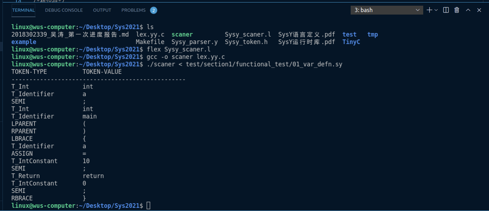
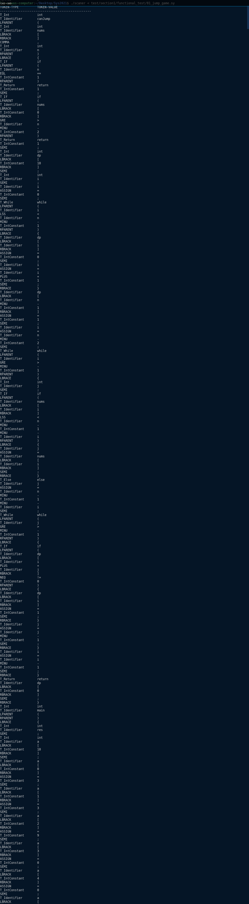

# 							试点班进度报告

## 一、总体进度情况

对编译原理课程进行了一个大概的学习，然后尝试对网上开源的去年比赛代码进行了阅读，然后着手开始制作自己的编译器，选择SysY2021作为要实现的语言，总体进度为词法分析已经完成（基于Flex工具进行词法分析），语法分析正在进行（目前在使用Bison进行实现）。目前主要学习了以下内容：

1. Flex工具使用
2. bison工具的使用
3. Makefile的编写与使用

## 二、词法分析的实现

一般来说，编译器的工作流程简单的说分为一下几部分：

1. 对源文件进行扫描，将源文件的字符流拆分分一个个的词（记号），此为词法分析。
2. 根据语法规则将这些记号构造出语法树，此为语法分析。
3. 对语法树的各个节点之间的关系进行检查，检查语义规则是否被违背，同时对语法树进行必要的优化，此为语义分析。
4. 遍历语法树的节点，将各节点转化为中间代码，并按特定的顺序拼装起来，此为中间代码生成。
5. 对中间代码进行优化。
6. 将中间代码转化为目标代码
7. 对目标代码进行优化，生成最终的目标程序

因此，词法分析往往是编译程序的第一步。词法分析器把程序代码的输入流切分成token，而语法分析器则接受些token并把token流构建成AST（抽象语法树）。通常来说，被解析成token的语言是基于上下文无关语法的。一个token可以是一个字符串，由一个或多个同一范畴的字符组成。对输入字符流构建成token的过程称为符号化。为了把输入的字符分组成token，还需要有特定的定界符。

Flex 主要是用在词法分析阶段，不需要我们去手写分析器，只需要制定好相应的正则表达式规则，他可以自动对输入文件进行词法分析。我们制定的TOKEN列表对应如下：

| 序号 | 名称             | 内容                |
| ---- | ---------------- | ------------------- |
| 1    | T_Identifier     | 标识符              |
| 2    | T_IntConstant    | 数值常量            |
| 3    | T_StringConstant | 字符串常量          |
| 4    | T_Const          | const               |
| 5    | T_Int            | int                 |
| 6    | T_Void           | void                |
| 7    | T_If             | if                  |
| 8    | T_Else           | else                |
| 9    | T_While          | while试点班进度报告 |
| 10   | T_Break          | break               |
| 11   | T_continue       | continue            |
| 12   | T_Return         | return              |
| 13   | PLUS             | +                   |
| 14   | MINU             | -                   |
| 15   | MULT             | *                   |
| 16   | DIV              | /                   |
| 17   | MOD              | %                   |
| 18   | LSS              | <                   |
| 19   | LEQ              | <=                  |
| 20   | GRE              | >                   |
| 21   | GEQ              | >=                  |
| 22   | EQL              | ==                  |
| 23   | NEQ              | !=                  |
| 24   | AND              | &&                  |
| 25   | OR               | \|\|                |
| 26   | NOT              | !                   |
| 27   | ASSIGN           | =                   |
| 28   | SEMICN           | ;                   |
| 29   | COMMA            | ,                   |
| 30   | LPARENT          | (                   |
| 31   | RPARENT          | )                   |
| 32   | LBRACK           | [                   |
| 33   | RBRACK           | ]                   |
| 34   | LBRACE           | {                   |
| 35   | RBRACE           | }                   |

具体的scaner.l如下：

```cpp
%{
#include "Sysy_token.h"试点班进度报告
#define YYSTYPE char *
#include "y.tab.h"
#include <stdio.h>
int cur_line_num = 1;
void init_scanner();
void lex_error(char* msg, int line);
%}

/* Definitions, note: \042 is '"' */
INTEGER             ([0-9]+)
UNTERM_STRING       (\042[^\042\n]*)
/*字符串*/
STRING              (\042[^\042\n]*\042)
/*标识符*/
IDENTIFIER          ([a-zA-Z][a-zA-Z0-9]*([_\.][a-zA-Z0-9]+)?)
comment             ((\/\/.*)|(\/\*(.*|\n*)\*\/))
whitespace          ([ \t\n\r\f\v]+)
%%

[\n]                { cur_line_num++;                       }
[ \t\r\a]+          { /* ignore all spaces */               }
 /*跳过空白和注释*/
{whitespace}        {}
{comment}           { printf("This is a commit.\n");        }

 /*关系运算符*/试点班进度报告
"<"				    { return LSS;               }
">"				    { return GRE;               }
"<="                { return LEQ;               }
">="                { return GEQ;               }
"=="                { return EQL;               }
"!="                { return NEQ;               }
 /*算术运算符*/
"-"				    { return MINU;              }
"+"				    { return PLUS;              }
"*"				    { return MULT;              }
"/"				    { return DIV;               }
"%"				    { return MOD;               }
"="                 { return ASSIGN;            }
 /*逻辑运算符*/
"&&"                { return AND;               }
"||"                { return OR;                }
"!"				    { return NOT;               }
 /*关键字*/
"void"              { return T_Void;            }
"int"               { return T_Int;             }
"while"             { return T_While;           }
"if"                { return T_If;              }
"else"              { return T_Else;            }
"return"            { return T_Return;          }
"break"             { return T_Break;           }
"continue"          { return T_Continue;        }
"const"			    { return T_Const;           }
 /*标点符号*/
"."                 { return DOT;               }
","                 { return COMMA;             }
";"                 { return SEMI;              }
"("                 { return LPARENT;           }
")"                 { return RPARENT;           }
"["                 { return LBRACK;            }
"]"                 { return RBRACK;            }
"{"                 { return LBRACE;            }
"}"                 { return RBRACE;            }
{INTEGER}           { return T_IntConstant;     }
{STRING}            { return T_StringConstant;  }
{IDENTIFIER}        { return T_Identifier;      }

<<EOF>>             { return 0; }

{UNTERM_STRING}     { lex_error("Unterminated string constant", cur_line_num);  }
.                   { lex_error("Unrecognized character", cur_line_num);        }

%%

int main(int argc, char* argv[]) 
{
    int token;
    init_scanner();
    while (token = yylex()) 
    {
        print_token(token);
        puts(yytext);
    }
    return 0;
}

void init_scanner() 
{
    printf("%-20s%s\n", "TOKEN-TYPE", "TOKEN-VALUE");
    printf("-------------------------------------------------\n");
}

void lex_error(char* msg, int line) 
{
    printf("\nError at line %-3d: %s\n\n", line, msg);
}

int yywrap(void) 
{
    return 1;
}
```

附上token.h

```cpp
#ifndef SYSY_TOKEN_H
#define SYSY_TOKEN_H

typedef enum 
{
    LSS = 256, GRE, LEQ, GEQ,EQL,NEQ, 
    AND, OR, NOT,
    MINU,PLUS,MULT,DIV,MOD,ASSIGN,
    T_Void, T_Int, T_While,T_If, T_Else, T_Return, T_Break,
    T_Continue,T_Const,
    DOT,COMMA,SEMI,LPARENT,RPARENT,LBRACK,RBRACK,LBRACE,RBRACE,
    T_Identifier,T_StringConstant,T_IntConstant

} TokenType;

static void print_token(int token) {
    static char* token_strs[] = {
        "LSS", "GRE", "LEQ", "GEQ" , "EQL" ,"NEQ", 
        "AND", "OR", "NOT",
        "MINU","PLUS","MULT","DIV","MOD","ASSIGN",
        "T_Void", "T_Int", "T_While","T_If", "T_Else", "T_Return", "T_Break",
        "T_Continue","T_Const",
        "DOT","COMMA","SEMI","LPARENT","RPARENT","LBRACK","RBRACK","LBRACE","RBRACE",
        "T_Identifier","T_StringConstant","T_IntConstant"
    };

    if (token < 256) 
    {
        printf("%-20c", token);
    } else {
        printf("%-20s", token_strs[token-256]);
    }
}

#endif

```

其中print_token是为了验证目前词法分析的正确性，下面有测试样例的展示

## 三、词法分析器的运行结果

为了验证词法分析器可以正常的使用，并将代码分成一个一个token，选用了去年毕昇杯发布的一些测试样例进行测试，测试结果如下：



源程序为：

```cpp
int a;
int main()
{
	a=10;
	return 0;
}

```

可以看到，对于这样简单的程序，我们的词法分析可以正常运行。

下面我们尝试一个比较复杂的程序：

```cpp
int canJump(int nums[], int n) {
    if(n == 1)
        return 1;
    if(nums[0] > n - 2)
        return 1;
    int dp[10];
    int i;
    i = 0;
    while(i<n-1){
        dp[i] = 0;
        i = i +1;
    }
    dp[n - 1] = 1;
    i = n - 2;
    while(i > -1){
        int j;
        if(nums[i] < n - 1 - i){
            j = nums[i];
        }
        else
            j = n - 1 - i;
        while(j > -1){
            if(dp[i+j] != 0){
                dp[i] = 1;
            }
            j = j - 1;
        }
        i = i - 1;
    }

    return dp[0];
}
int main(){
    int res;
    int a[10];
    a[0]=3;a[1]=3;a[2]=9;a[3]=0;a[4]=0;
    a[5]=1;a[6]=1;a[7]=5;a[8]=7;a[9]=8;
    res = 10;
    res = canJump(a, res);
    return res;
}
```

运行结果如下：



可以看出，所有的符号都可以对应的进行分析。

## 四、下一步计划与当前的问题

1. 尽快完成语法分析工作。
2. 准备着手编译器后端的实现。
3. 因为在阅读去年参赛队伍的代码时候发现，自己对C++的了解过于浅显，因此还需要深入学习一下C++的语法，尤其是对于命名域（namespace）的使用，之前浅显的停留在了只使用std的水平。


