# 2021年试点班报告-Sysy2021编译器

## 1.总体情况

1. 编译器语言

   Sys2021

2. 开发环境

   操作系统:Ubuntu18.04

   开发语言:C++

   开发环境:g++

   IDE: vscode + Clion

   仿真测试平台:QEMU

3. 工具使用情况

   前端使用flex+bision的组合进行词法和文法分析

4. 总体代码规模统计

   不算工具生成的代码规模如下:

   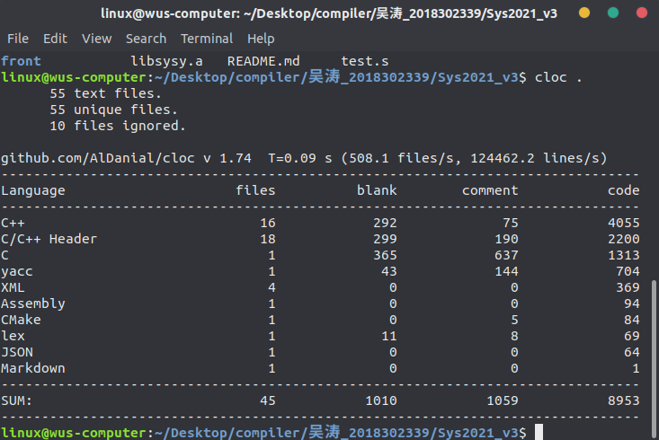

5. 代码分模块统计

   - 前端代码统计

     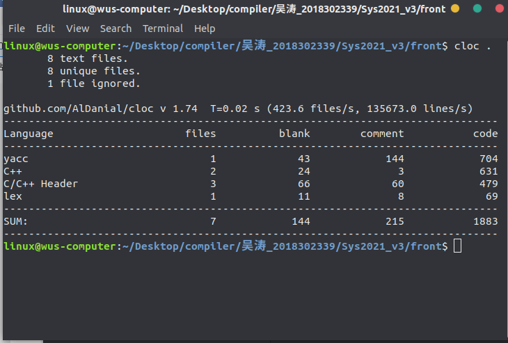

   - IRBuilder部分统计

     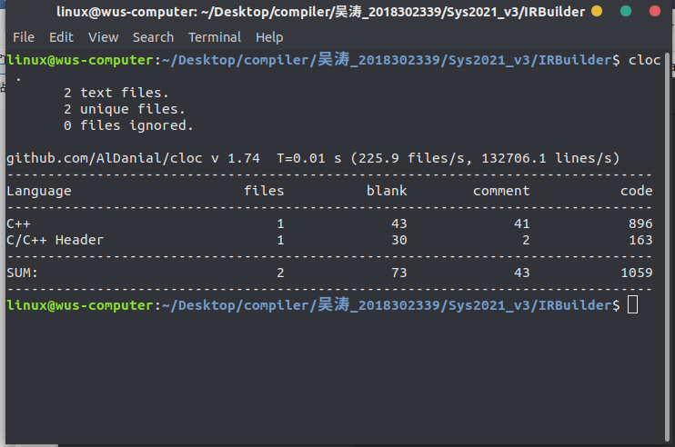

   - IR部分统计

     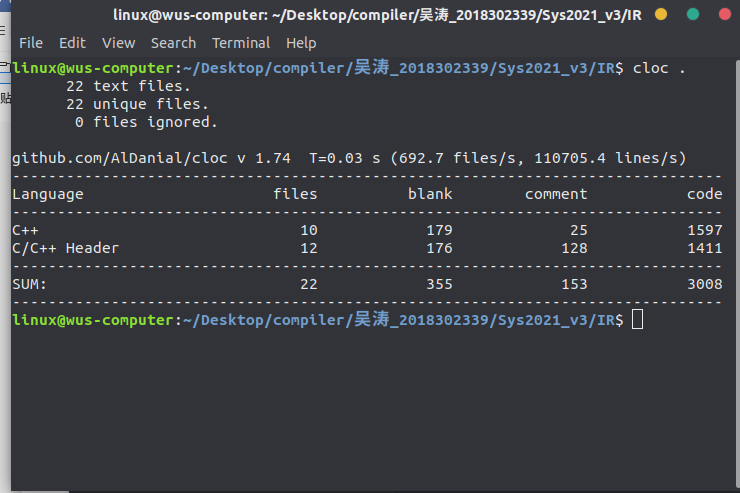

   - 后端代码统计

     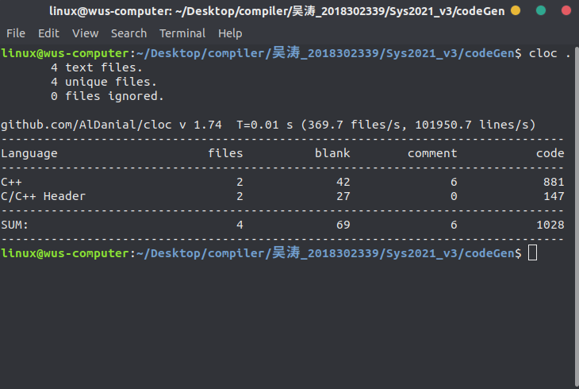

## 2.语言定义

官方给定的语言定义如下:

```
文法的EBNF范式如下：

- 符号[...]表示方括号内包含的为可选项

- 符号{...}表示花括号内包含的为可重复 0 次或多次的项

- 终结符或者是由单引号括起的串,或者是 Ident、InstConst 这样的记号

- SysY 语言的文法表示如下,其中 CompUnit 为开始符号:

  编译单元		CompUnit →[ CompUnit ] ( Decl | FuncDef ) 

  声明				Decl →ConstDecl | VarDecl 

  常量声明		ConstDecl →'const' BType ConstDef { ',' ConstDef } ';' 

  基本类型		BType →'int'

  常数定义		ConstDef→Ident { '[' ConstExp ']' } '=' ConstInitVal 

  常量初值		ConstInitVal→ConstExp   | '{' [ ConstInitVal { ',' ConstInitVal } ] '}'

  变量声明		VarDecl →BType VarDef { ',' VarDef } ';' 

  变量定义		VarDef →Ident { '[' ConstExp ']' } | Ident { '[' ConstExp ']' } '=' InitVal   

  变量初值		InitVal→Exp | '{' [ InitVal { ',' InitVal } ] '}' 

  函数定义		FuncDef →FuncType Ident '(' [FuncFParams] ')' Block 

  函数类型		FuncType →'void' | 'int' 

  函数形参表	FuncFParams→FuncFParam { ',' FuncFParam } 

  函数形参		FuncFParam →BType Ident ['[' ']' { '[' Exp ']' }] 

  语句块			Block →'{' { BlockItem } '}' 

  语句块项		BlockItem →Decl | Stmt 

  语句				Stmt →LVal '=' Exp ';' | [Exp] ';'  | Block | 'if' '( Cond ')' Stmt [ 'else' Stmt ] | 						'while' '(' Cond ')' Stmt | 'break' ';'    | 'continue' ';' | 'return' [Exp] ';' 

  表达式			Exp →AddExp     注：SysY表达式是int型表达式

  条件表达式	Cond →LOrExp

  左值表达式	LVal →Ident {'[' Exp ']'} 

  基本表达式	PrimaryExp→'(' Exp ')' | LVal | Number 

  数值				Number→IntConst 

  一元表达式	UnaryExp→PrimaryExp | Ident '(' [FuncRParams] ')'   | UnaryOp UnaryExp 

  单目运算符	UnaryOp →'+' | '−' | '!'    注：'!'仅出现在条件表达式中

  函数实参表	FuncRParams→Exp { ',' Exp } 

  乘除模表达式MulExp→UnaryExp | MulExp ('*' | '/' | '%') UnaryExp 

  加减表达式	AddExp→MulExp | AddExp ('+' | '−') MulExp 

  关系表达式	RelExp→AddExp | RelExp ('<' | '>' | '<=' | '>=') AddExp

  相等性表达式EqExp→RelExp | EqExp ('==' | '!=') RelExp 

  逻辑与表达式LAndExp→EqExp | LAndExp '&&' EqExp 

  逻辑或表达式LOrExp→LAndExp | LOrExp '||' LAndExp 

  常量表达式	ConstExp→AddExp         注：使用的Ident必须是常量
```

实现时候我们的词法表关系如下:

| 序号 | 名称          | 内容                |
| ---- | ------------- | ------------------- |
| 1    | T_IDENTIFIER  | 标识符              |
| 2    | T_NUMBER      | 数值常量            |
| 3    | T_LETTER      | 字符串常量          |
| 4    | T_CONST       | const               |
| 5    | T_INT         | int                 |
| 6    | T_VOID        | void                |
| 7    | T_IF          | if                  |
| 8    | T_ELSE        | else                |
| 9    | T_WHILE       | while试点班进度报告 |
| 10   | T_BREAK       | break               |
| 11   | T_CONTINUE    | continue            |
| 12   | T_RETURN      | return              |
| 13   | T_ADD         | +                   |
| 14   | T_SUB         | -                   |
| 15   | T_MUL         | *                   |
| 16   | T_DIV         | /                   |
| 17   | T_MOD         | %                   |
| 18   | T_LT          | <                   |
| 19   | T_LTE         | <=                  |
| 20   | T_GT          | >                   |
| 21   | T_GTE         | >=                  |
| 22   | T_EQ          | ==                  |
| 23   | T_NEQ         | !=                  |
| 24   | T_AND         | &&                  |
| 25   | T_OR          | \|\|                |
| 26   | T_NOT         | !                   |
| 27   | T_ASSIGN      | =                   |
| 28   | T_SEMICOLIN   | ;                   |
| 29   | T_COMMA       | ,                   |
| 30   | T_LPARENTHESE | (                   |
| 31   | T_RPARENTHESE | )                   |
| 32   | T_LBRACKET    | [                   |
| 33   | T_RBRACKET    | ]                   |
| 34   | T_LBRACE      | {                   |
| 35   | T_RBRACE      | }                   |


利用工具实现后得到的文法如下:

```
grammar

    0 $accept: CompUnit $end

    1 CompUnit: DeclDef
    2         | CompUnit DeclDef
    3         | CompUnit T_END

    4 DeclDef: ConstDecl
    5        | VarDecl
    6        | FuncDef

    7 ConstDecl: T_CONST FuncType ConstDefList T_SEMICOLIN

    8 ConstDefList: ConstDefList T_COMMA ConstDef
    9             | ConstDef

   10 ConstDef: T_IDENTIFIER ArrayConstExpList T_ASSIGN ConstInitVal

   11 ArrayConstExpList: ArrayConstExpList T_LBRACKET ConstExp T_RBRACKET
   12                  | %empty

   13 ConstInitVal: ConstExp
   14             | T_LBRACE T_RBRACE
   15             | T_LBRACE ConstInitValList T_RBRACE

   16 ConstInitValList: ConstInitVal
   17                 | ConstInitValList T_COMMA ConstInitVal

   18 VarDecl: FuncType VarDefList T_SEMICOLIN

   19 VarDefList: VarDef
   20           | VarDefList T_COMMA VarDef

   21 VarDef: T_IDENTIFIER ArrayConstExpList
   22       | T_IDENTIFIER ArrayConstExpList T_ASSIGN InitVal

   23 InitVal: Exp
   24        | T_LBRACE T_RBRACE
   25        | T_LBRACE InitValList T_RBRACE

   26 InitValList: InitVal
   27            | InitValList T_COMMA InitVal

   28 FuncDef: FuncType T_IDENTIFIER T_LPARENTHESE T_RPARENTHESE Block
   29        | FuncType T_IDENTIFIER T_LPARENTHESE FuncFParams T_RPARENTHESE Block

   30 FuncFParams: FuncFParam
   31            | FuncFParams T_COMMA FuncFParam

   32 FuncFParam: FuncType T_IDENTIFIER
   33           | FuncType T_IDENTIFIER ParamArrayExpList

   34 ParamArrayExpList: ParamArrayExpList T_LBRACKET Exp T_RBRACKET
   35                  | T_ARRAY

   36 Block: T_LBRACE BlockItemList T_RBRACE

   37 BlockItemList: BlockItemList BlockItem
   38              | %empty

   39 BlockItem: ConstDecl
   40          | VarDecl
   41          | Stmt

   42 Stmt: BreakStmt
   43     | ContinueStmt
   44     | AssignStmt
   45     | Exp T_SEMICOLIN
   46     | T_SEMICOLIN
   47     | Block
   48     | SelectStmt
   49     | IterationStmt
   50     | ReturnStmt

   51 BreakStmt: T_BREAK T_SEMICOLIN

   52 ContinueStmt: T_CONTINUE T_SEMICOLIN

   53 AssignStmt: LVal T_ASSIGN Exp T_SEMICOLIN

   54 SelectStmt: T_IF T_LPARENTHESE Cond T_RPARENTHESE Stmt
   55           | T_IF T_LPARENTHESE Cond T_RPARENTHESE Stmt T_ELSE Stmt

   56 IterationStmt: T_WHILE T_LPARENTHESE Cond T_RPARENTHESE Stmt

   57 ReturnStmt: T_RETURN T_SEMICOLIN
   58           | T_RETURN Exp T_SEMICOLIN

   59 Exp: AddExp

   60 Cond: LOrExp

   61 LVal: T_IDENTIFIER ArrayExpList

   62 ArrayExpList: ArrayExpList T_LBRACKET Exp T_RBRACKET
   63             | %empty

   64 PrimaryExp: T_LPARENTHESE Exp T_RPARENTHESE
   65           | LVal
   66           | Number

   67 Number: T_NUMBER

   68 UnaryExp: PrimaryExp
   69         | Callee
   70         | UnaryOp UnaryExp

   71 Callee: T_IDENTIFIER T_LPARENTHESE T_RPARENTHESE
   72       | T_IDENTIFIER T_LPARENTHESE FuncRParams T_RPARENTHESE

   73 UnaryOp: T_ADD
   74        | T_SUB
   75        | T_NOT

   76 FuncRParams: FuncRParams T_COMMA Exp
   77            | Exp

   78 MulExp: UnaryExp
   79       | MulExp T_MUL UnaryExp
   80       | MulExp T_DIV UnaryExp
   81       | MulExp T_MOD UnaryExp

   82 AddExp: MulExp
   83       | AddExp T_ADD MulExp
   84       | AddExp T_SUB MulExp

   85 RelExp: AddExp
   86       | RelExp T_LT AddExp
   87       | RelExp T_GT AddExp
   88       | RelExp T_LTE AddExp
   89       | RelExp T_GTE AddExp

   90 EqExp: RelExp
   91      | EqExp T_EQ RelExp
   92      | EqExp T_NEQ RelExp

   93 LAndExp: EqExp
   94        | LAndExp T_AND EqExp

   95 LOrExp: LAndExp
   96       | LOrExp T_OR LAndExp

   97 ConstExp: AddExp

   98 FuncType: T_VOID
   99         | T_INT
```


## 3.语言语法覆盖情况论述

1. 写法说明

   

2. 语法测试情况覆盖表

   

## 4.设计说明

1. 文件构成说明

   ```
   ├── codeGen // 后端实现
   │   ├── codeGen.cc
   │   ├── codeGen.hh
   │   ├── instructionsGen.cc
   │   └── instructionsGen.hh
   ├── front // 词法分析和文法分析的实现
   │   ├── syntax_tree.cc
   │   ├── syntax_tree.hh
   │   ├── sysy_driver.cc
   │   ├── sysy_driver.hh
   │   └── sysyFlexLexer.hh
   ├── IR // 中间代码IR块实现
   │   ├── BasicBlock.cc
   │   ├── BasicBlock.h
   │   ├── Constant.cc
   │   ├── Constant.h
   │   ├── Function.cc
   │   ├── Function.h
   │   ├── GlobalVariable.cc
   │   ├── GlobalVariable.h
   │   ├── Instruction.cc
   │   ├── Instruction.h
   │   ├── IRBuilder.h
   │   ├── IRprinter.cc
   │   ├── IRprinter.h
   │   ├── Module.cc
   │   ├── Module.h
   │   ├── ReturnVal.h
   │   ├── Type.cc
   │   ├── Type.h
   │   ├── User.cc
   │   ├── User.h
   │   ├── Value.cc
   │   └── Value.h
   ├── IRBuilder //IRbuid的实现
   │   ├── SysyBuilder.cc
   │   └── SysyBuilder.h
   ├── main.cc // 主函数
   ├── Sysy_parser.y //文法分析bison
   └── Sysy_scaner.l //词法分析flex
   
   ```

   

2. 中间表示说明

   为了方便验证的我们的IR部分是否正确,我们在设计的时候决定生成LLVM标准中间代码,LLVM中间代码的设计说明如下:

   1. LLVM IR中的数据表示

      我们在程序中可以用来表示的数据，一共分为三类：

      * 寄存器中的数据
      * 栈上的数据
      * 数据区里的数据

      LLVM IR中，我们需要表示的数据也是以上三种。那么，这三种数据各有什么特点，又需要根据LLVM的特性做出什么样的调整呢？

      #### 数据区里的数据

      我们知道，数据区里的数据，其最大的特点就是，能够给整个程序的任何一个地方使用。同时，数据区里的数据也是占静态的二进制可执行程序的体积的。所以，我们应该只将需要全程序使用的变量放在数据区中。而现代编程语言的经验告诉我们，这类全局静态变量应该越少越好。

      同时，由于LLVM是面向多平台的，所以我们还需要考虑的是该怎么处理这些数据。一般来说，大多数平台的可执行程序格式中都会包含`.DATA`分区，用来存储这类的数据。但除此之外，每个平台还有专门的更加细致的分区，比如说，Linux的ELF格式中就有`.rodata`来存储只读的数据。因此，LLVM的策略是，让我们尽可能细致地定义一个全局变量，比如说注明其是否只读等，然后依据各个平台，如果平台的可执行程序格式支持相应的特性，就可以进行优化。

      一般来说，在LLVM IR中定义一个存储在数据区中的全局变量，其格式为：

      ```llvm
      @global_variable = global i32 0
      ```

      这个语句定义了一个`i32`类型的全局变量`@global_variable`，并且将其初始化为`0`。

      如果是只读的全局变量，也就是常量，我们可以用`constant`来代替`global`：

      ```llvm
      @global_constant = constant i32 0
      ```

      这个语句定义了一个`i32`类型的全局常量`@global_constant`，并将其初始化为`0`。

      #### 寄存器内的数据和栈上的数据

      这两种数据我选择放在一起讲。我们知道，除了DMA等奇技淫巧之外，大多数对数据的操作，如加减乘除、比大小等，都需要操作的是寄存器内的数据。那么，我们为什么需要把数据放在栈上呢？主要有两个原因：

      * 寄存器数量不够
      * 需要操作内存地址

      如果我们一个函数内有三四十个局部变量，但是家用型CPU最多也就十几个通用寄存器，所以我们不可能把所有变量都放在寄存器中，因此我们需要把一部分数据放在内存中，栈就是一个很好的存储数据的地方；此外，有时候我们需要直接操作内存地址，但是寄存器并没有通用的地址表示，所以只能把数据放在栈上来完成对地址的操作。

      因此，在不操作内存地址的前提下，栈只是寄存器的一个替代品。

      #### 寄存器

      正因为如此，LLVM IR引入了虚拟寄存器的概念。在LLVM IR中，一个函数的局部变量可以是寄存器或者栈上的变量。对于寄存器而言，我们只需要像普通的赋值语句一样操作，但需要注意名字必须以`%`开头：

      ```llvm
      %local_variable = add i32 1, 2
      ```

      此时，`%local_variable`这个变量就代表一个寄存器，它此时的值就是`1`和`2`相加的结果。我们可以写一个简单的程序验证这一点：

      ```llvm
      ; register_test.ll
      target datalayout = "e-m:o-i64:64-f80:128-n8:16:32:64-S128"
      target triple = "x86_64-apple-macosx10.15.0"
      
      define i32 @main() {
      	%local_variable = add i32 1, 2
      	ret i32 %local_variable
      }
      ```

      我们在x86_64的macOS系统上查看其编译出的汇编代码，其主函数为：

      ```assembly
      _main:
      	movl	$2, %eax
      	addl	$1, %eax
      	retq
      ```

      确实这个局部变量`%local_variable`变成了寄存器`eax`。

      关于寄存器，我们还需了解一点。在不同的ABI下，会有一些called-saved register和calling-saved register。简单来说，就是在函数内部，某些寄存器的值不能改变。或者说，在函数返回时，某些寄存器的值要和进入函数前相同。比如，在System V的ABI下，`rbp`, `rbx`, `r12`, `r13`, `r14`, `r15`都需要满足这一条件。由于LLVM IR是面向多平台的，所以我们需要一份代码适用于多种ABI。因此，LLVM IR内部自动帮我们做了这些事。如果我们把所有没有被保留的寄存器都用光了，那么LLVM IR会帮我们把这些被保留的寄存器放在栈上，然后继续使用这些被保留寄存器。当函数退出时，会帮我们自动从栈上获取到相应的值放回寄存器内。

      那么，如果所有通用寄存器都用光了，该怎么办？LLVM IR会帮我们把剩余的值放在栈上，但是对我们用户而言，实际上都是虚拟寄存器，用户是感觉不到差别的。

      因此，我们可以粗略地理解LLVM IR对寄存器的使用：

      * 当所需寄存器数量较少时，直接使用called-saved register，即不需要保留的寄存器
      * 当called-saved register不够时，将calling-saved register原本的值压栈，然后使用calling-saved register
      * 当寄存器用光以后，就把多的虚拟寄存器的值压栈

      我们可以写一个简单的程序验证。对于x86_64架构下，我们只需要使用15个虚拟寄存器就可以验证这件事。我们将其编译成汇编语言之后，可以看到在函数开头就有

      ```assembly
      pushq	%r15
      pushq	%r14
      pushq	%r13
      pushq	%r12
      pushq	%rbx
      ```

      也就是把那些需要保留的寄存器压栈。然后随着寄存器用光，第15个虚拟寄存器就会使用栈：

      ```assembly
      movl	%ecx, -4(%rsp)
      addl	$1, %ecx
      ```

      ### 栈

      我们之前说过，当不需要操作地址并且寄存器数量足够时，我们可以直接使用寄存器。而LLVM IR的策略保证了我们可以使用无数的虚拟寄存器。那么，在需要操作地址以及需要可变变量（之后会提到为什么）时，我们就需要使用栈。

      LLVM IR对栈的使用十分简单，直接使用`alloca`指令即可。如：

      ```llvm
      %local_variable = alloca i32
      ```

      就可以声明一个在栈上的变量了。

   2. LLVM IR的数据类型表示

      #### 基本的数据类型

      LLVM IR中比较基本的数据类型包括：

      * 空类型（`void`）
      * 整型（`iN`）
      * 浮点型（`float`、`double`等）

      空类型一般是作为不返回值的函数的返回类型，没有特别的含义，就代表「什么都没有」。

      整型是指`i1`, `i8`, `i16`, `i32`, `i64`这类的数据类型。这里`iN`的`N`可以是任意正整数，可以是`i3`，`i1942652`。但最常用，最符合常理的就是`i1`以及8的整数倍。`i1`有两个值：`true`和`false`。也就是说，下面的代码可以正确编译：

      ```llvm
      %boolean_variable = alloca i1
      store i1 true, i1* %boolean_variable
      ```

      对于大于1位的整型，也就是如`i8`, `i16`等类型，我们可以直接用数字字面量赋值：

      ```llvm
      %integer_variable = alloca i32
      store i32 128, i32* %integer_variable
      store i32 -128, i32* %integer_variable
      ```

      #### 符号

      有一点需要注意的是，在LLVM IR中，整型默认是有符号整型，也就是说我们可以直接将`-128`以补码形式赋值给`i32`类型的变量。在LLVM IR中，整型的有无符号是体现在操作指令而非类型上的，比方说，对于两个整型变量的除法，LLVM IR分别提供了`udiv`和`sdiv`指令分别适用于无符号整型除法和有符号整型除法：

      ```llvm
      %1 = udiv i8 -6, 2	; get (256 - 6) / 2 = 125
      %2 = sdiv i8 -6, 2	; get (-6) / 2 = -3
      ```

      我们可以用这样一个简单的程序验证：

      ```llvm
      ; div_test.ll
      target datalayout = "e-m:o-i64:64-f80:128-n8:16:32:64-S128"
      target triple = "x86_64-apple-macosx10.15.0"
      
      define i8 @main() {
      	%1 = udiv i8 -6, 2
      	%2 = sdiv i8 -6, 2
      	
      	ret i8 %1
      }
      ```

      分别将`ret`语句的参数换成`%1`和`%2`以后，将代码编译成可执行文件，在终端下运行并查看返回值即可。

      总结一下就是，LLVM IR中的整型默认按有符号补码存储，但一个变量究竟是否要被看作有无符号数需要看其参与的指令。

      1. LLVM IR中的数据表示

         我们在程序中可以用来表示的数据，一共分为三类：

         * 寄存器中的数据
         * 栈上的数据
         * 数据区里的数据

         LLVM IR中，我们需要表示的数据也是以上三种。那么，这三种数据各有什么特点，又需要根据LLVM的特性做出什么样的调整呢？

         #### 数据区里的数据

         我们知道，数据区里的数据，其最大的特点就是，能够给整个程序的任何一个地方使用。同时，数据区里的数据也是占静态的二进制可执行程序的体积的。所以，我们应该只将需要全程序使用的变量放在数据区中。而现代编程语言的经验告诉我们，这类全局静态变量应该越少越好。

         同时，由于LLVM是面向多平台的，所以我们还需要考虑的是该怎么处理这些数据。一般来说，大多数平台的可执行程序格式中都会包含`.DATA`分区，用来存储这类的数据。但除此之外，每个平台还有专门的更加细致的分区，比如说，Linux的ELF格式中就有`.rodata`来存储只读的数据。因此，LLVM的策略是，让我们尽可能细致地定义一个全局变量，比如说注明其是否只读等，然后依据各个平台，如果平台的可执行程序格式支持相应的特性，就可以进行优化。

         一般来说，在LLVM IR中定义一个存储在数据区中的全局变量，其格式为：

         ```llvm
         @global_variable = global i32 0
         ```

         这个语句定义了一个`i32`类型的全局变量`@global_variable`，并且将其初始化为`0`。

         如果是只读的全局变量，也就是常量，我们可以用`constant`来代替`global`：

         ```llvm
         @global_constant = constant i32 0
         ```

         这个语句定义了一个`i32`类型的全局常量`@global_constant`，并将其初始化为`0`。

         #### 寄存器内的数据和栈上的数据

         这两种数据我选择放在一起讲。我们知道，除了DMA等奇技淫巧之外，大多数对数据的操作，如加减乘除、比大小等，都需要操作的是寄存器内的数据。那么，我们为什么需要把数据放在栈上呢？主要有两个原因：

         * 寄存器数量不够
         * 需要操作内存地址

         如果我们一个函数内有三四十个局部变量，但是家用型CPU最多也就十几个通用寄存器，所以我们不可能把所有变量都放在寄存器中，因此我们需要把一部分数据放在内存中，栈就是一个很好的存储数据的地方；此外，有时候我们需要直接操作内存地址，但是寄存器并没有通用的地址表示，所以只能把数据放在栈上来完成对地址的操作。

         因此，在不操作内存地址的前提下，栈只是寄存器的一个替代品。

         #### 寄存器

         正因为如此，LLVM IR引入了虚拟寄存器的概念。在LLVM IR中，一个函数的局部变量可以是寄存器或者栈上的变量。对于寄存器而言，我们只需要像普通的赋值语句一样操作，但需要注意名字必须以`%`开头：

         ```llvm
         %local_variable = add i32 1, 2
         ```

         此时，`%local_variable`这个变量就代表一个寄存器，它此时的值就是`1`和`2`相加的结果。我们可以写一个简单的程序验证这一点：

         ```llvm
         ; register_test.ll
         target datalayout = "e-m:o-i64:64-f80:128-n8:16:32:64-S128"
         target triple = "x86_64-apple-macosx10.15.0"
         
         define i32 @main() {
         	%local_variable = add i32 1, 2
         	ret i32 %local_variable
         }
         ```

         我们在x86_64的macOS系统上查看其编译出的汇编代码，其主函数为：

         ```assembly
         _main:
         	movl	$2, %eax
         	addl	$1, %eax
         	retq
         ```

         确实这个局部变量`%local_variable`变成了寄存器`eax`。

         关于寄存器，我们还需了解一点。在不同的ABI下，会有一些called-saved register和calling-saved register。简单来说，就是在函数内部，某些寄存器的值不能改变。或者说，在函数返回时，某些寄存器的值要和进入函数前相同。比如，在System V的ABI下，`rbp`, `rbx`, `r12`, `r13`, `r14`, `r15`都需要满足这一条件。由于LLVM IR是面向多平台的，所以我们需要一份代码适用于多种ABI。因此，LLVM IR内部自动帮我们做了这些事。如果我们把所有没有被保留的寄存器都用光了，那么LLVM IR会帮我们把这些被保留的寄存器放在栈上，然后继续使用这些被保留寄存器。当函数退出时，会帮我们自动从栈上获取到相应的值放回寄存器内。

         那么，如果所有通用寄存器都用光了，该怎么办？LLVM IR会帮我们把剩余的值放在栈上，但是对我们用户而言，实际上都是虚拟寄存器，用户是感觉不到差别的。

         因此，我们可以粗略地理解LLVM IR对寄存器的使用：

         * 当所需寄存器数量较少时，直接使用called-saved register，即不需要保留的寄存器
         * 当called-saved register不够时，将calling-saved register原本的值压栈，然后使用calling-saved register
         * 当寄存器用光以后，就把多的虚拟寄存器的值压栈

         我们可以写一个简单的程序验证。对于x86_64架构下，我们只需要使用15个虚拟寄存器就可以验证这件事。我们将其编译成汇编语言之后，可以看到在函数开头就有

         ```assembly
         pushq	%r15
         pushq	%r14
         pushq	%r13
         pushq	%r12
         pushq	%rbx
         ```

         也就是把那些需要保留的寄存器压栈。然后随着寄存器用光，第15个虚拟寄存器就会使用栈：

         ```assembly
         movl	%ecx, -4(%rsp)
         addl	$1, %ecx
         ```

         ### 栈

         我们之前说过，当不需要操作地址并且寄存器数量足够时，我们可以直接使用寄存器。而LLVM IR的策略保证了我们可以使用无数的虚拟寄存器。那么，在需要操作地址以及需要可变变量（之后会提到为什么）时，我们就需要使用栈。

         LLVM IR对栈的使用十分简单，直接使用`alloca`指令即可。如：

         ```llvm
         %local_variable = alloca i32
         ```

         就可以声明一个在栈上的变量了。

      2. LLVM IR的数据类型表示

         #### 基本的数据类型

         LLVM IR中比较基本的数据类型包括：

         * 空类型（`void`）
         * 整型（`iN`）
         * 浮点型（`float`、`double`等）

         空类型一般是作为不返回值的函数的返回类型，没有特别的含义，就代表「什么都没有」。

         整型是指`i1`, `i8`, `i16`, `i32`, `i64`这类的数据类型。这里`iN`的`N`可以是任意正整数，可以是`i3`，`i1942652`。但最常用，最符合常理的就是`i1`以及8的整数倍。`i1`有两个值：`true`和`false`。也就是说，下面的代码可以正确编译：

         ```llvm
         %boolean_variable = alloca i1
         store i1 true, i1* %boolean_variable
         ```

         对于大于1位的整型，也就是如`i8`, `i16`等类型，我们可q以直接用数字字面量赋值：

         ```llvm
         %integer_variable = alloca i32
         store i32 128, i32* %integer_variable
         store i32 -128, i32* %integer_variable
         ```

         #### 符号

         有一点需要注意的是，在LLVM IR中，整型默认是有符号整型，也就是说我们可以直接将`-128`以补码形式赋值给`i32`类型的变量。在LLVM IR中，整型的有无符号是体现在操作指令而非类型上的，比方说，对于两个整型变量的除法，LLVM IR分别提供了`udiv`和`sdiv`指令分别适用于无符号整型除法和有符号整型除法：

         ```llvm
         %1 = udiv i8 -6, 2	; get (256 - 6) / 2 = 125
         %2 = sdiv i8 -6, 2	; get (-6) / 2 = -3
         ```

         我们可以用这样一个简单的程序验证：

         ```llvm
         ; div_test.ll
         target datalayout = "e-m:o-i64:64-f80:128-n8:16:32:64-S128"
         target triple = "x86_64-apple-macosx10.15.0"
         
         define i8 @main() {
         	%1 = udiv i8 -6, 2
         	%2 = sdiv i8 -6, 2
         	
         	ret i8 %1
         }
         ```

         分别将`ret`语句的参数换成`%1`和`%2`以后，将代码编译成可执行文件，在终端下运行并查看返回值即可。

         总结一下就是，LLVM IR中的整型默认按有符号补码存储，但一个变量究竟是否要被看作有无符号数需要看其参与的指令。

      3. LLVM IR的控制语句

         #### LLVM IR层面的控制语句

         下面就以我们上面的`for`循环的C语言版本为例，解释如何写其对应的LLVM IR语句。

         首先，我们对应的LLVM IR的基本框架为

         ```llvm
         %i = alloca i32 ; int i = ...
         store i32 0, i32* %i ; ... = 0
         %i_value = load i32, i32* %i
         ; do something A
         %1 = add i32 %i_value, 1 ; ... = i + 1
         store i32 %1, i32* %i ; i = ...
         ; do something B
         ```

         这个程序缺少了一些必要的步骤，而我们之后会将其慢慢补上。

         #### 标签

         在LLVM IR中，标签与汇编语言的标签一致，也是以`:`结尾作标记。我们依照之前写的汇编语言的伪代码，给这个程序加上标签：

         ```llvm
         	%i = alloca i32 ; int i = ...
         	store i32 0, i32* %i ; ... = 0
         start:
         	%i_value = load i32, i32* %i
         A:
         	; do something A
         	%1 = add i32 %i_value, 1 ; ... = i + 1
         	store i32 %1, i32* %i ; i = ...
         B:
         	; do something B
         ```

         #### 比较指令

         LLVM IR提供的比较指令为`icmp`。其接受三个参数：比较方案以及两个比较参数。这样讲比较抽象，我们就来看一下一个最简单的比较指令的例子：

         ```llvm
         %comparison_result = icmp uge i32 %a, %b
         ```

         这个例子转化为C++语言就是

         ```c++
         bool comparison_result = ((unsigned int)a >= (unsigned int)b);
         ```

         这里，`uge`是比较方案，`%a`和`%b`就是用来比较的两个数，而`icmp`则返回一个`i1`类型的值，也就是C++中的`bool`值，用来表示结果是否为真。

         `icmp`支持的比较方案很广泛：

         * 首先，最简单的是`eq`与`ne`，分别代表相等或不相等。
         * 然后，是无符号的比较`ugt`, `uge`, `ult`, `ule`，分别代表大于、大于等于、小于、小于等于。我们之前在数的表示中提到，LLVM IR中一个整型变量本身的符号是没有意义的，而是需要看在其参与的指令中被看作是什么符号。这里每个方案的`u`就代表以无符号的形式进行比较。
         * 最后，是有符号的比较`sgt`, `sge`, `slt`, `sle`，分别是其无符号版本的有符号对应。

         我们来看加上比较指令之后，我们的例子就变成了：

         ```llvm
         	%i = alloca i32 ; int i = ...
         	store i32 0, i32* %i ; ... = 0
         start:
         	%i_value = load i32, i32* %i
         	%comparison_result = icmp slt i32 %i_value, 4 ; test if i < 4
         A:
         	; do something A
         	%1 = add i32 %i_value, 1 ; ... = i + 1
         	store i32 %1, i32* %i ; i = ...
         B:
         	; do something B
         ```

         #### 条件跳转

         在比较完之后，我们需要条件跳转。我们来看一下我们此刻的目的：若`%comparison_result`是`true`，那么跳转到`A`，否则跳转到`B`。

         LLVM IR为我们提供的条件跳转指令是`br`，其接受三个参数，第一个参数是`i1`类型的值，用于作判断；第二和第三个参数分别是值为`true`和`false`时需要跳转到的标签。比方说，在我们的例子中，就应该是

         ```llvm
         br i1 %comparison_result, label %A, label %B
         ```

         我们把它加入我们的例子：

         ```llvm
         	%i = alloca i32 ; int i = ...
         	store i32 0, i32* %i ; ... = 0
         start:
         	%i_value = load i32, i32* %i
         	%comparison_result = icmp slt i32 %i_value, 4 ; test if i < 4
         	br i1 %comparison_result, label %A, label %B
         A:
         	; do something A
         	%1 = add i32 %i_value, 1 ; ... = i + 1
         	store i32 %1, i32* %i ; i = ...
         B:
         	; do something B
         ```

         #### 无条件跳转

         无条件跳转更好理解，直接跳转到某一标签处。在LLVM IR中，我们同样可以使用`br`进行条件跳转。如，如果要直接跳转到`start`标签处，则可以

         ```llvm
         br label %start
         ```

         我们也把这加入我们的例子：

         ```llvm
         	%i = alloca i32 ; int i = ...
         	store i32 0, i32* %i ; ... = 0
         start:
         	%i_value = load i32, i32* %i
         	%comparison_result = icmp slt i32 %i_value, 4 ; test if i < 4
         	br i1 %comparison_result, label %A, label %B
         A:
         	; do something A
         	%1 = add i32 %i_value, 1 ; ... = i + 1
         	store i32 %1, i32* %i ; i = ...
         	br label %start
         B:
         	; do something B
         ```

         

      4. LLVM IR中的函数

         #### 函数定义

         在LLVM中，一个最基本的函数定义的样子我们之前已经遇到过多次，就是`@main`函数的样子：

         ```llvm
         define i32 @main() {
         	ret i32 0
         }
         ```

         在函数名之后可以加上参数列表，如：

         ```llvm
         define i32 @foo(i32 %a, i64 %b) {
         	ret i32 0
         }
         ```

         一个函数定义最基本的框架，就是返回值（`i32`）+函数名（`@foo`）+参数列表（`(i32 %a, i64 %b）`）+函数体（`{ ret i32 0 }`）。

         我们可以看到，函数的名称和全局变量一样，都是以`@`开头的。并且，如果我们查看符号表的话，也会发现其和全局变量一样进入了符号表。因此，函数也有和全局变量完全一致的Linkage Types和Visibility Style，来控制函数名在符号表中的出现情况，因此，可以出现如

         ```llvm
         define private i32 @foo() {
         	; ...
         }
         ```

         这样的修饰符。

         此外，我们还可以在参数列表之后加上之前说的属性，也就是控制优化器和代码生成器的指令。

         #### 函数声明

         除了函数定义之外，还有一种情况十分常见，那就是函数声明。我们在一个编译单元（模块）下，可以使用别的模块的函数，这时候就需要在本模块先声明这个函数，才能保证编译时不出错，从而在链接时正确将声明的函数与别的模块下其定义进行链接。

         函数声明也相对比较简单，就是使用`declare`关键词替换`define`：

         ```llvm
         declare i32 @printf(i8*, ...) #1
         ```

         这个就是在C代码中调用`stdio.h`库的`printf`函数时，在LLVM IR代码中可以看到的函数声明，其中`#1`就是又一大串属性组成的属性组。

         #### 函数的调用

         在LLVM IR中，函数的调用与高级语言几乎没有什么区别：

         ```llvm
         define i32 @foo(i32 %a) {
         	; ...
         }
         
         define void @bar() {
         	%1 = call i32 @foo(i32 1)
         }
         ```

         使用`call`指令可以像高级语言那样直接调用函数。我们来仔细分析一下这里做了哪几件事：

         * 传递参数
         * 执行函数
         * 获得返回值

   3. LLVM IR的控制语句

      #### LLVM IR层面的控制语句

      下面就以我们上面的`for`循环的C语言版本为例，解释如何写其对应的LLVM IR语句。

      首先，我们对应的LLVM IR的基本框架为

      ```llvm
      %i = alloca i32 ; int i = ...
      store i32 0, i32* %i ; ... = 0
      %i_value = load i32, i32* %i
      ; do something A
      %1 = add i32 %i_value, 1 ; ... = i + 1
      store i32 %1, i32* %i ; i = ...
      ; do something B
      ```

      这个程序缺少了一些必要的步骤，而我们之后会将其慢慢补上。

      #### 标签

      在LLVM IR中，标签与汇编语言的标签一致，也是以`:`结尾作标记。我们依照之前写的汇编语言的伪代码，给这个程序加上标签：

      ```llvm
      	%i = alloca i32 ; int i = ...
      	store i32 0, i32* %i ; ... = 0
      start:
      	%i_value = load i32, i32* %i
      A:
      	; do something A
      	%1 = add i32 %i_value, 1 ; ... = i + 1
      	store i32 %1, i32* %i ; i = ...
      B:
      	; do something B
      ```

      #### 比较指令

      LLVM IR提供的比较指令为`icmp`。其接受三个参数：比较方案以及两个比较参数。这样讲比较抽象，我们就来看一下一个最简单的比较指令的例子：

      ```llvm
      %comparison_result = icmp uge i32 %a, %b
      ```

      这个例子转化为C++语言就是

      ```c++
      bool comparison_result = ((unsigned int)a >= (unsigned int)b);
      ```

      这里，`uge`是比较方案，`%a`和`%b`就是用来比较的两个数，而`icmp`则返回一个`i1`类型的值，也就是C++中的`bool`值，用来表示结果是否为真。

      `icmp`支持的比较方案很广泛：

      * 首先，最简单的是`eq`与`ne`，分别代表相等或不相等。
      * 然后，是无符号的比较`ugt`, `uge`, `ult`, `ule`，分别代表大于、大于等于、小于、小于等于。我们之前在数的表示中提到，LLVM IR中一个整型变量本身的符号是没有意义的，而是需要看在其参与的指令中被看作是什么符号。这里每个方案的`u`就代表以无符号的形式进行比较。
      * 最后，是有符号的比较`sgt`, `sge`, `slt`, `sle`，分别是其无符号版本的有符号对应。

      我们来看加上比较指令之后，我们的例子就变成了：

      ```llvm
      	%i = alloca i32 ; int i = ...
      	store i32 0, i32* %i ; ... = 0
      start:
      	%i_value = load i32, i32* %i
      	%comparison_result = icmp slt i32 %i_value, 4 ; test if i < 4
      A:
      	; do something A
      	%1 = add i32 %i_value, 1 ; ... = i + 1
      	store i32 %1, i32* %i ; i = ...
      B:
      	; do something B
      ```

      #### 条件跳转

      在比较完之后，我们需要条件跳转。我们来看一下我们此刻的目的：若`%comparison_result`是`true`，那么跳转到`A`，否则跳转到`B`。

      LLVM IR为我们提供的条件跳转指令是`br`，其接受三个参数，第一个参数是`i1`类型的值，用于作判断；第二和第三个参数分别是值为`true`和`false`时需要跳转到的标签。比方说，在我们的例子中，就应该是

      ```llvm
      br i1 %comparison_result, label %A, label %B
      ```

      我们把它加入我们的例子：

      ```llvm
      	%i = alloca i32 ; int i = ...
      	store i32 0, i32* %i ; ... = 0
      start:
      	%i_value = load i32, i32* %i
      	%comparison_result = icmp slt i32 %i_value, 4 ; test if i < 4
      	br i1 %comparison_result, label %A, label %B
      A:
      	; do something A
      	%1 = add i32 %i_value, 1 ; ... = i + 1
      	store i32 %1, i32* %i ; i = ...
      B:
      	; do something B
      ```

      #### 无条件跳转

      无条件跳转更好理解，直接跳转到某一标签处。在LLVM IR中，我们同样可以使用`br`进行条件跳转。如，如果要直接跳转到`start`标签处，则可以

      ```llvm
      br label %start
      ```

      我们也把这加入我们的例子：

      ```llvm
      	%i = alloca i32 ; int i = ...
      	store i32 0, i32* %i ; ... = 0
      start:
      	%i_value = load i32, i32* %i
      	%comparison_result = icmp slt i32 %i_value, 4 ; test if i < 4
      	br i1 %comparison_result, label %A, label %B
      A:
      	; do something A
      	%1 = add i32 %i_value, 1 ; ... = i + 1
      	store i32 %1, i32* %i ; i = ...
      	br label %start
      B:
      	; do something B
      ```

      

   4. LLVM IR中的函数

      #### 函数定义

      在LLVM中，一个最基本的函数定义的样子我们之前已经遇到过多次，就是`@main`函数的样子：

      ```llvm
      define i32 @main() {
      	ret i32 0
      }
      ```

      在函数名之后可以加上参数列表，如：

      ```llvm
      define i32 @foo(i32 %a, i64 %b) {
      	ret i32 0
      }
      ```

      一个函数定义最基本的框架，就是返回值（`i32`）+函数名（`@foo`）+参数列表（`(i32 %a, i64 %b）`）+函数体（`{ ret i32 0 }`）。

      我们可以看到，函数的名称和全局变量一样，都是以`@`开头的。并且，如果我们查看符号表的话，也会发现其和全局变量一样进入了符号表。因此，函数也有和全局变量完全一致的Linkage Types和Visibility Style，来控制函数名在符号表中的出现情况，因此，可以出现如

      ```llvm
      define private i32 @foo() {
      	; ...
      }
      ```

      这样的修饰符。

      此外，我们还可以在参数列表之后加上之前说的属性，也就是控制优化器和代码生成器的指令。

      #### 函数声明

      除了函数定义之外，还有一种情况十分常见，那就是函数声明。我们在一个编译单元（模块）下，可以使用别的模块的函数，这时候就需要在本模块先声明这个函数，才能保证编译时不出错，从而在链接时正确将声明的函数与别的模块下其定义进行链接。

      函数声明也相对比较简单，就是使用`declare`关键词替换`define`：

      ```llvm
      declare i32 @printf(i8*, ...) #1
      ```

      这个就是在C代码中调用`stdio.h`库的`printf`函数时，在LLVM IR代码中可以看到的函数声明，其中`#1`就是又一大串属性组成的属性组。

      #### 函数的调用

      在LLVM IR中，函数的调用与高级语言几乎没有什么区别：

      ```llvm
      define i32 @foo(i32 %a) {
      	; ...
      }
      
      define void @bar() {
      	%1 = call i32 @foo(i32 1)
      }
      ```

      使用`call`指令可以像高级语言那样直接调用函数。我们来仔细分析一下这里做了哪几件事：

      * 传递参数
      * 执行函数
      * 获得返回值

      最后我们实现的结果为,我们可以直接生成利用lli工具直接进行运行的代码中间代码(当然,如果要调用getint等动态链接库里的内容,我们也需要在用lli运行的时候加入)

3. IR部分的设计(也是一大特色吧)

   在IR设计上,我们参考了中科大实验课所给定的LightIR进行设计与实现,具体情况如下:

   ### 核心类概念图

   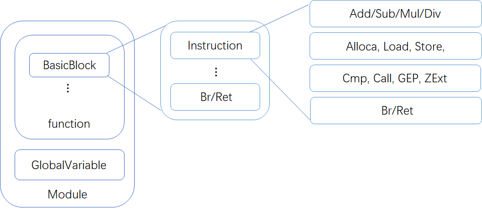

   ### BasicBlock

   - 含义：基本块，是一个是单入单出的代码块，该类维护了一个指令链表，基本块本身属于 Value, 类型是 \<label\>，会被分支指令调用

   - 成员：

     - instr_list_：指令链表
     - pre_bbs_： bb前驱集合
     - succ_bbs_：bb后继集合

   - API: 

     ```c++
     static BasicBlock *create(Module *m, const std::string &name)
     // 创建并返回BB块，参数分别是BB块所属的Module，name是其名字默认为空，BB块所属的Function
     // 设置BB块所属的函数
     void setParent(Function *parent)
     // 返回BB块所属的函数
     Function *getParent() const
     // 返回BB块所属的Module
     Module *getModule() const;
     // 返回指令链表头
     auto rbegin()
     // 返回指令链表的结尾
     auto rend()
     // 返回BB块的指令链表
     std::list<Instruction *> &getInstructions()
     // 返回BB块的终止指令(return|break)若BB块最后一条指令不是终止指令返回null
     Instruction *getTerminator()
      // 将instr指令添加到此BB块指令链表结尾，调用IRBuilder里来创建函数会自动调用此方法
     void addInstruction(Instruction *instr);
     // 将instr指令添加到此BB块指令链表开头
     void addInstrBegin(Instruction *instr);
     // 判断BB块指令链表是否为空
     bool empty()
     // 返回BB块中指令的数目
     int getNumOfInstr());
     //在pos后插入Instr
     void insertInstr(Instruction *pos, Instruction *insert);
     // 从BB块指令链表删除instr指令
     void deleteInstr(Instruction *instr);
     // 返回前驱快集合
     std::list<BasicBlock *> &getPreBasicBlocks()
     // 返回后继块集合
     std::list<BasicBlock *> &getSuccBasicBlocks()
     // 添加前驱块
     void addPreBasicBlock(BasicBlock *bb)
     // 添加后继驱块
     void addSuccBasicBlock(BasicBlock *bb)
     // 移除前驱块
     void removePreBasicBlock(BasicBlock *bb)
     // 移除后继块
     void removeSuccBasicBlock(BasicBlock *bb)
     
     
     ```


   ### Constant

   - 继承：User

   - 含义：常数，各种类型常量的基类

   - 子类：

     - ConstantInt：

       - 含义：int类型的常数

       - 成员：

         - val_：常数值

       - API：

         ```cpp
         int getValue() // 返回该常数类型中存的常数值
         static int getValue(ConstantInt *const_val)// 返回该常数类型const_val中存的常数值
         void setValue(int val)// 修改常数值
         static ConstantInt *get(int val, Module *m);) // 以val值来创建常数类
         virtual std::string print() //用于生成LLVM格式的中间代码
         ```

     - ConstantArray

       - 含义：数组类型的常数

       - 成员：

         - const_array_：数组常量值

       - API：

         ```c++
         // 获取index下标的元素
         Constant *getElementValue(int index);
         // 返回数组的大小
         unsigned getNumElements() const
         // LLVM格式中间代码生成
         virtual std::string print() override;
         ```

         


   ### Function

   - 含义：函数，该类描述 LLVM 的一个简单过程，维护基本块表，格式化参数表

   - 成员：

     - basic_blocks_：基本块列表
     - arguments_：形参列表
     - parent_：函数属于的module

   - API：

     ```cpp
     //创建并返回Function,
     //参数依次是待创建函数类型ty，函数名字name(不可为空），函数所属的Module
     static Function *create(FunctionType *ty, const std::string &name,
                                 Module *pa-rent);
     // 返回函数类的函数类型
     FunctionType *getFunctionType() const;
     // 返回此函数类型的返回值类型
     Type *getResultType() const;
     // 将bb添加至Function的链表上(调用bb的创建函数会自动调用此函数挂在function的bb链表上
     void addBasicBlock(BasicBlock *bb);
     // 将bb添加至Function的链表上的一个位置
     void addBasicBlockAfter(std::list<BasicBlock *>::iterator after_pos,
                                 BasicBlock *bb);
     // 换区函数形参数量
     unsigned getNumArgs() const;
     // 得到函数基本块数量
     unsigned getNumBasicBlocks() const
     // 得到函数所属的Module
     Module *getParent() const;
     // 获取函数的形参链表
     std::list<Argument *> &getArgs()
     //获取第一个bb块
     BasicBlock *getEntryBlock()
     //得到函数形参的list的起始迭代器
     std::list<Argument *>::iterator arg_begin()
     //得到函数形参的list的最后一个迭代器
     std::list<Argument *>::iterator arg_end()
     // 去除基本块
     // 给函数中未命名的基本块和指令命名
     void setInstrName();
     //输出LLVM中间代码
     std::string print() override;
     ```

     

   - 相关类：

     - Argument：

       - 含义：参数

       - 成员：

         - arg_no_：参数序号
         - parent_：参数属于哪个函数

       - API

         ```cpp
         // 返回参数属于哪个函数
         inline const Function *getParent() const
         inline Function *getParent()
         /// 返回参数所在函数的第几个参数 eg:"void foo(int a, float b)" a is 0 and b
         /// is 1.
         unsigned getArgNo() const
         ```

   ### GlobalVariable

   - 含义：全局变量，该类用于表示全局变量，是 GlobalValue 的子类，根据地址来访问

   - 成员：

     - is_const：是否为常量
     - init_val_：初始值

   - API：

     ```c++
     // 获取初始值
     Constant *getInit()
     // 输出LLVM格式的中间代码
     std::string print();
     ```

     

   ### IRBuilder

   - 含义：生成IR的辅助类，该类提供了独立的接口创建各种 IR 指令，并将它们插入基本块中, 该辅助类不做任何类型检查。

   - API：

     ```cpp
     BasicBlock *GetInsertBlock()// 返回正在插入指令的BB
     void SetInsertPoint(BasicBlock *bb)// 设置当前需要插入指令的bb
     Instruction *create_[instr_type]()// 创建instr_type(具体名字参考IRBuilder.h代码)的指令并对应插入到正在插入的BB块，这种类型的指令看函数名字和参数名字和IR文档是一一对应的。
     ```

     

   ### Instruction

   - 继承：从User继承
   - 含义：指令，该类是所有 LLVM 指令的基类，主要维护指令的操作码（指令类别），指令所属的基本块，指令的操作数个数信息
   - 成员：
     - parent_：指令所属的BasicBlock
     - op_id_：指令的类型id
     - num_ops_指令的操作数个数
   - 子类：
     - BinaryInst：双目运算指令包括add、sub、mul、div
     - 其他子类和前述文档中提到的指令一一对应，不在此赘述。
   - API：所有指令的创建都要通过IRBuilder进行

   ### Module

   - 含义：一个编译单元，在此源语言的意义下是一个文件

   - 成员：

     - function_list_：函数链表，记录了这个编译单元的所有函数
     - global_list_：全局变量链表
     - instr_id2string_：通过指令类型id得到其打印的string
     - module_name_, source_file_name_：未使用
     - 从module中能取到的基本类型

   - API：

     ```cpp
     Type *get_void_type(); 
     //将f挂在module的function链表上，在function被创建的时候会自动调用此方法来添加function
     void addFunction(Function *f);
     //将g挂在module的GlobalVariable链表上，在GlobalVariable被创建的时候会自动调用此方法来添加GlobalVariable
     void addGlobalVariable(GlobalVariable *g);
     //从GlobalVariable链表上删除v
     void removeGlobalVariable(GlobalVariable *v)
     // 获取function链表
     std::list<Function *> &getFunctions()
     //获取全局变量列表
     std::list<GlobalVariable *> &getGlobalVariables()
     // 获取instr对应的指令名(打印ir时调用)
     std::string getInstrOpName(Instruction::OpID instr)
     ```

     

   ### Type

   - 含义：IR的类型，该类是所有类型的超类

   - 成员：

     - tid_：枚举类型，表示type的类型（包含VoidType、LabelType、IntegerTy、FunctionTyID、ArrayType、PointerType）

   - 子类：

     - IntegerType

       - 含义：int 类型

       - 成员：

         - num_bits：长度

       - API：

         ```cpp
          unsigned getNumBits();// 返回int的位数
         ```

     - FunctionType

       - 含义：函数类型

       - 成员：

         - result_：返回值类型
         - args_：参数类型列表

       - API：

         ```cpp
         static FunctionType *get(Type *result, std::vector<Type*> params);
         // 返回函数类型，参数依次是返回值类型result，形参类型列表params
         unsigned getNumArgs() const;
         // 返回形参个数
         Type *getArgType(unsigned i) const;
         //返回函数类型中的返回值类型
         Type *getResultType() const; 
         // 返回形参类型列表的终止迭代器    
         Type *getReturnType() const;
         // 返回函数类型中的返回值类型
         ```

     - ArrayType

       - 含义：数组类型

       - 成员：

         - contained_：数组成员的类型
         - num_elements_：数组维数

       - API：

         ```cpp
         static ArrayType *get(Type *contained, unsigned num_elements)
         // 返回数组类型，参数依次是 数组元素的类型contained，数组元素个数num_elements
         Type *getElementType() const 
         // 返回数组元素类型
         unsigned getNumOfElements() const
         // 返回数组元素个数
         ```

     - PointerType

       - 含义：指针类型

       - 成员：

         - contained_：指针指向的类型

       - API：

         ```cpp
         Type *getElementType() const { return contained_; }
         // 返回指针指向的类型
         static PointerType *get(Type *contained);
         // 创建指向contained类型的指针类型
         ```

   - API:

     ```cpp
     bool is_void_type()// 判断是否是void类型其他类型有类似API请查看Type.h
     static Type *get_void_type(Module *m);// 得到void类型
     Type *get_pointer_element_type();// 若是PointerType则返回指向的类型，若不是则返回nullptr。
     Type *get_array_element_type();// 若是ArrayType则返回指向的类型，若不是则返回nullptr。
     ```

     

   ### User

   - 继承：从value继承

   - 含义：使用者，提供一个操作数表，表中每个操作数都直接指向一个 Value, 提供了 use-def 信息，它本身是 Value 的子类， Value 类会维护一个该数据使用者的列表，提供def-use信息。简单来说操作数表表示我用了谁，该数据使用者列表表示谁用了我。这两个表在后续的**优化实验**会比较重要请务必理解。

   - 成员：

     - operands_：参数列表，表示这个使用者所用到的参数
     - num_ops_：表示该使用者使用的参数的个数

   - API：

     ```cpp
     // 从 user 的操作数链表中取出第 i 个操作数
     Value *getOperand(unsigned i) const;
     // 将 user 的第 i 个操作数设为 v
     void setOperand(unsigned i, Value *v);
     // 将 v 挂到 User 的操作数链表上
     void addOperand(Value *v);
     // 从 User 的操作数链表中的所有操作数处的 use_list_ 移除该 User;
     void removeOperand(unsigned i);
     // 移除操作数链表中索引为 index1-index2 的操作数,例如想删除第 0 个操作数:
     void removeOperand(unsigned i, unsigned j);
     // 得到操作数链表的大小
     unsigned getNumOperand() const;
     ```

   


   ### Value 

   - 含义：最基础的类，代表一个操作数，代表一个可能用于指令操作数的带类型数据

   - 成员：

     - use_list_：记录了所有使用该操作数的指令的列表
     - name_：名字
     - type_：类型，一个type类，表示操作数的类型

   - API：

     ```cpp
     Type *getType() const //返回这个操作数的类型
     std::list<Use> &getUseList() // 返回value的使用者链表
     void addUse(Value *val, unsigned arg_no = 0);
     // 添加val至this的使用者链表上
     void replace_all_use_with(Value *new_val);
     // 将this在所有的地方用new_val替代，并且维护好use_def与def_use链表
     void removeUse(Value *val);
     // 将val从this的use_list_中移除
     ```

4. 测试结果

   首先我们可以先测试一下编译器能否正常编译所有文件

   编译前文件夹如下所示:

   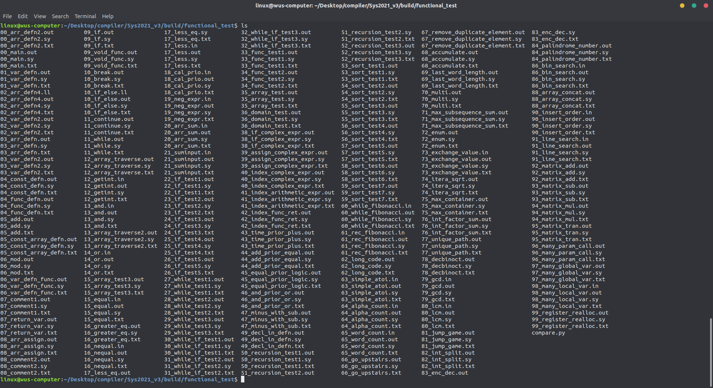

   编译后文件夹:

   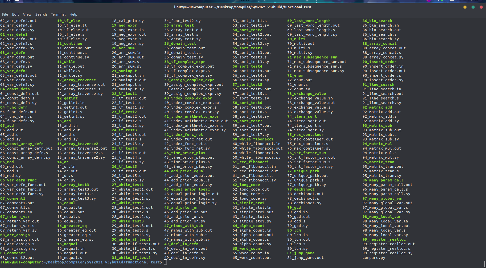

   可以看到,每一个代码都对应了一个.s文件(汇编代码)和可执行文件(可以使用qemu-arm进行测试)

   我们用一个简单的代码来展示一下编译器的效果

   ```c++
   int a;
   int main(){
   	a = 10;
   	if( a>0 ){
   		return 1;
   	}
   	else{
   		return 0;
   	}
   }
   ```

   输出我们的语法树结构如下所示:

   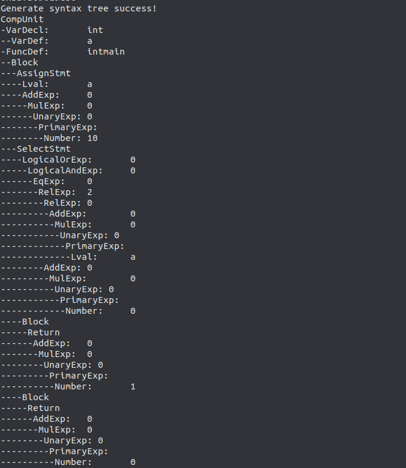

   中间代码为LLVM格式的中间代码

   ```llvm
   ; ModuleID = 'SysY code'
   source_filename = ""
   @a = global i32 0
   declare i32 @getint()
   
   declare i32 @getch()
   
   declare void @putint(i32)
   
   declare void @putch(i32)
   
   declare i32 @getarray(i32*)
   
   declare i32 @putarray(i32, i32*)
   
   declare void @_sysy_starttime(i32)
   
   declare void @_sysy_stoptime(i32)
   
   define i32 @main() {
   entry:
     store i32 10, i32* @a
     %op0 = load i32, i32* @a
     %op1 = icmp sgt i32 %op0, 0
     %op2 = zext i1 %op1 to i32
     %op3 = icmp ne i32 %op2, 0
     br i1 %op3, label %label4, label %label5
   label4:                                                ; preds = %entry
     ret i32 1
   label5:                                                ; preds = %entry
     ret i32 0
   }
   ```

   生成的arm7-a汇编

   ```arm
       .arch armv7-a
       .file ""
       .text
       .global main
       .syntax unified
       .arm
       .global a
   .global_vars:
       .long a
   main:
   .main_pre:
       push {lr}
       mov r12, #16
       sub sp, sp, r12
   .main_entry:
       ldr lr, =#10
       adrl r11, .global_vars+0
       ldr r12, [r11, #0]
       str lr, [r12, #0]
       adrl r11, .global_vars+0
       ldr lr, [r11, #0]
       ldr r12, [lr, #0]
       str r12, [sp, #0]
       ldr r12, [sp, #0]
       ldr lr, =#0
       cmp r12, lr
       mov r12, #0
       movgt r12, #1
       str r12, [sp, #4]
       ldr r12, [sp, #4]
       str r12, [sp, #8]
       ldr r12, [sp, #8]
       ldr lr, =#0
       cmp r12, lr
       mov r12, #0
       movne r12, #1
       str r12, [sp, #12]
       ldr r12, [sp, #12]
       cmp r12, #0
       bne .main_label4+0
       b .main_label5+0
   .main_label4:
       ldr r0, =#1
       mov r12, #16
       add sp, sp, r12
       pop {pc}
   .main_label5:
       ldr r0, =#0
       mov r12, #16
       add sp, sp, r12
       pop {pc}
   .main_post:
       .data
   a:
       .long 0
   ```

   最后生成的可执行文件的运行结果

   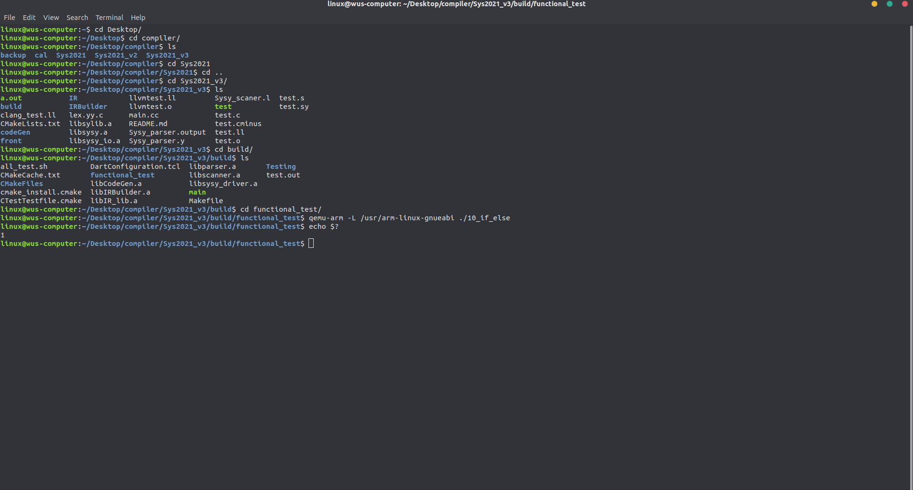

   我们可以看到,程序正常的运行,与我们预期相符合

   我们在所有写了一个脚本,用我们的编译器编译所有的测试样例生成am汇编,并在qemu-arm中进行执行,把输出重定向到与可执行文件同名字的txt中,脚本如下:

   ```bash
   #!/bin/bash
   cd ./functional_test/
   filenames=$(ls *.sy)
   for file in ${filenames};do
       /home/linux/Desktop/compiler/Sys2021_v3/build/main ${file}
   done
   filenames=$(ls *.s)
   for file in ${filenames};do
       echo ${file%.*}
       arm-linux-gnueabi-gcc -o ${file%.*} -g ${file} ../../libsylib.a
       if [ -e ${file%.*}.in ] ;then
   	    echo ${file%.*}.in
   	    qemu-arm -L /usr/arm-linux-gnueabi ${file%.*} <  ${file%.*}.in > ${file%.*}.txt
       else
   	    qemu-arm -L /usr/arm-linux-gnueabi ${file%.*} > ${file%.*}.txt
       fi
       result=$(echo $?)
       echo -e >> ${file%.*}.txt
       echo ${result} >> ${file%.*}.txt
   done
   ```

   并用Python代码比对官方提供的out文件与我们执行的txt文件

   ```python
   import os
   import sys
   from tqdm import tqdm
   
   
   def deleteSpaceLines(dirname):
   
       for maindir, subdir, file_name_list in os.walk(dirname):
           for filename in tqdm(file_name_list):
               path = os.path.join(maindir, filename)
               if(os.path.splitext(path)[1]!='.txt'):
                   continue
               txt = []
               f1 = open(path,'r',encoding='ascii')
               cnt=0
               for line in f1.readlines():
                   if cnt==0 and line == '\n':
                       continue
                   txt.append(line)
               f1.close()
               os.remove(path)
               f2 = open(path,'w',encoding='ascii')
               f2.write(''.join(txt))
               f2.close()
   def Comparetxt(dirname):
       for maindir, subdir, file_name_list in os.walk(dirname):
           for filename in tqdm(file_name_list):
               path = os.path.join(maindir, filename)
               if(os.path.splitext(path)[1]!='.txt'):
                   continue
               file=os.path.splitext(path)[0]+'.out'
               txt = []
               txt2 = []
               f1 = open(path,'r',encoding='ascii')
               for line in f1.readlines():
                   txt.append(line.strip('\n'))
               f1.close()
               f2 = open(file,'r',encoding='ascii')
               for line in f2.readlines():
                   txt2.append(line.strip('\n'))
               f2.close()
               # print(file)
               # print(txt)
               # print(txt2)
               for i in range(len(txt)):
                   if txt[i]!=txt2[i]:
                       print("Error")
                       print(txt)
                       print(txt2)
                       print(os.path.splitext(path)[0])
                       break
   
   if __name__ == '__main__':
       path="./"
       print("############## Delete Begin ###############")
       deleteSpaceLines(path)
       print("################ Delete OK ################")
       print("############## Check Begin ################")
       Comparetxt(path)
       print("################ Check OK ################")
   ```

   批量测试的时候首先去除一些输出文件的第一行的空格(是由于有的程序输出运行时间)

   当有错误的时候,输出答案与我们的测试结果,以及出错的样例的名字

   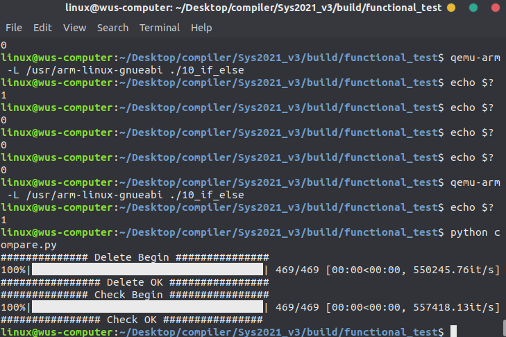

   可于看到我们所有的样例都可以正常的通过.

## 5.自我评价

通过本次试点班的学习和编写Sysy2021语法的编译器,我不仅通过自己亲自实现了一个编译器,学习了编译原理相关的知识,并且,在实现的过程中,对课本的知识有了更深层次的理解,在实现的过程中也重新学习了C++其他的特性,例如智能指针等,也大量运用了面向对象的设计思想,同时也要感谢同学的帮助,在我陷入困境的时候及时的帮助,共同探讨,共同解决问题.本次的试点班也有着一些遗憾吧,在寄存器分配上由于在IR部分投入了大量的时间,并没有进行优化,选择了最简单粗暴的方面去分配,当然,在之后也会进行进一步的对编译器进行一定的优化,来继续完善自己编写的Sys2021编译器.