# 第三次进度报告

## 1.总体进度说明

上周主要着力于语法分析的框架，本周主要进行了语法分析树木的建立，并在主体进行研究如何生成中间代码。主要进行了以下工作：

1. 初步在完成利用bison工具进行语法分析的基础上建立语法树。
2. 查找中间代码生成的相关资料。
3. 学习中科大的代码结构。

但是本周由于事情有些多，投入的时间不是很多，因此未能完成中间代码的生成，计划在下周完成

## 2.中间代码生成简介

在编译器的分析-综合模型中，前端对源程序进行分析并产生中间表示，后端在此基础上生成目标代码。理想情况下，和源语言相关的细节在前端分析中处理，而关于目标机器的细节则在后端处理。和中间代码相关的内容包括中间代码表示、静态类型检查和中间代码生成。

表达式的有向无环图（Directed Acyclic Graph，简称DAG）与语法分析树类似，一个DAG的叶子结点对应于原子运算分量，内部结点对应于运算符。与语法分析树不同的是，如果DAG中一个结点N表示一个公共子表达式，那么N可能有多个父结点。举个例子，表达式a+a*(b-c)+(b-c)*d的DAG如下：

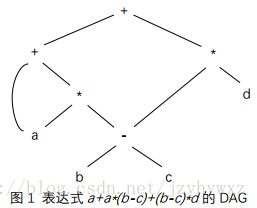

DAG的每个结点通常作为一条记录被存放在数组中，一个记录包括的结点信息有：

    结点标号：如果记录表示叶子结点，那么结点标号是该结点的文法符号；如果记录表示内部结点，那么结点标号是运算符；
    词法值：如果记录表示叶子结点，那么记录还包括该结点的词法值，通常是一个指向符号表的指针或者一个常量；
    左右子结点：如果记录表示内部结点，那么记录还包括该结点的左右子结点。

由于一个DAG的结点都会保存在一个记录数组中，因此我们可以通过数组下标引用某个记录从而获取结点信息，这个数组下标称为相应结点的值编码。

对图1的DAG，它的记录数组为：

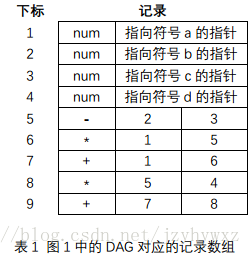

其中，左边的下标是每个结点的值编码，并且在某些记录中可以包括值编码。例如：对于第5条记录，它表示内部结点”-“，该结点左边的子结点是叶子结点”b”，右边的子结点是叶子结点”c”，由于代表b和c的记录已经存在并且它们的值编码分别为2和3，因此内部结点”-“的记录为(-, 2, 3)。
三地址代码

三地址代码是形如x = y op z的指令集合，之所以名为“三地址代码”，是因为指令x = y op z具有三个地址：两个运算分量y和z，一个结果变量x。由于三地址代码会对多运算符算术表达式和控制流语句的嵌套结构进行拆分，因此适用于目标代码的生成和优化。

三地址代码基于两个基本的概念：地址和指令。简单地说，地址就是运算分量，指令就是运算符，一个地址的表现形式可以是变量名、常量或者编译器生成的临时变量。下面是几种常见的三地址指令形式：

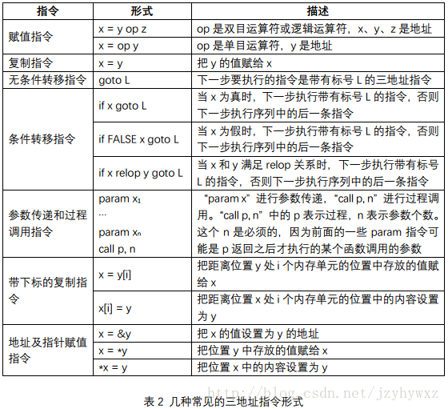

除此之外，另一种方式是用记录表示三地址代码中的每条指令，四元式、三元式和间接三元式是三种用记录表示三地址代码的方式。
四元式

一个四元式是一条表示三地址指令的记录，它有4个字段：

    op：表示一个运算符；
    arg1：表示第一个运算分量；
    arg2：表示第二个运算分量；
    result：表示结果变量。

一个四元式中可能用到了所有4个字段，也可能只用到了其中几个字段，它的几个特例如下：

    形如x = minus y的单目运算符指令不使用arg2字段，”minus”表示单目减运算符；
    形如x = y的赋值指令不使用arg2字段，并且它的op字段是”=”；
    形如param x的参数传递指令不使用arg2和result字段；
    条件和非条件转移指令将目标标号放入result字段。

下图是一个例子，左边给出了三地址代码，右边是对应的四元式表示：

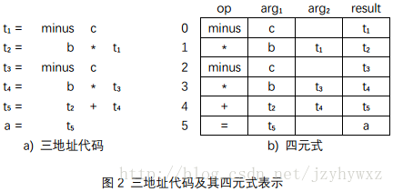

三元式

通过图2我们发现，一段三地址代码对应的四元式被存放在一个记录数组中，这一点和DAG结点的记录数组很像；另外，四元式中的result字段主要被用于保存临时变量名，这个临时变量是由编译器生成的。如果我们仿照DAG的记录数组用值编码表示临时变量的地址，那么就可以省略四元式中的result字段，三元式就是由此而来的。

一个三元式只有3个字段：op、arg1和arg2，它们的含义和在四元式中相同。为了取代四元式中的result字段，三元式用值编码表示结果变量的地址。图2中三地址代码的三元式表示如下：

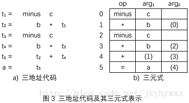


在图3(b)中，表格左边的数字是值编码，它表示三元式的结果变量的地址，并且这些值编码可以在三元式中被使用（使用的时候用括号括起来）。另外，对形如x=y的赋值指令，和四元式不同的是，三元式的op字段是”=”，arg1字段是”x”，arg2字段是”y”。
间接三元式

三地址代码的三元式表示存在一个问题，如果记录数组中的某条记录R的位置发生改变，那么所有使用到记录R的值编码的记录都需要更新。举个例子，在图3(b)中，如果把第1和第2条记录的位置互换，那么第3和第4条记录的内容都会发生改变。为了解决这个问题，提出了用间接三元式来表示三地址代码。

一个间接三元式在三元式的基础上增加了一个列表，这个列表包含了指向三元式的指针。仍以例子说明，下图是图3中三元式的间接三元式：

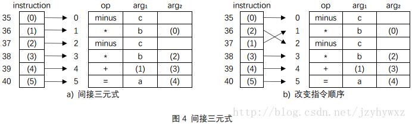

图4(a)是图3(b)的间接三元式，它使用了一个instruction数组保存要执行的指令，每条指令是一个指向某个三元式的指针。这样的话，当我们改变指令顺序时，就不用再更新三元式了，如图4(b)所示。
静态单赋值形式

静态单赋值（Static Single Assignment，简称SSA）形式是另一种中间表示形式，它和三地址代码的主要区别在于：

第一，SSA中的所有赋值都是针对具有不同名字的变量的，这也是“静态单赋值”名字的由来。这一特性如下图中表示：

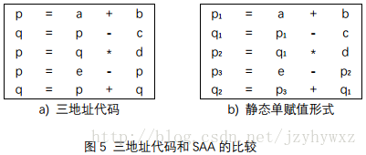


第二，由于同一个变量可能在两个不同的控制流路径中被定值，因此SSA使用一种被称为φ函数的表示规则将这个变量的两处定值合并起来。这一特性如下图所示：

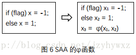

## 3.计划实现中间代码生成的方式

1. 直接与LLVM的IR相连

   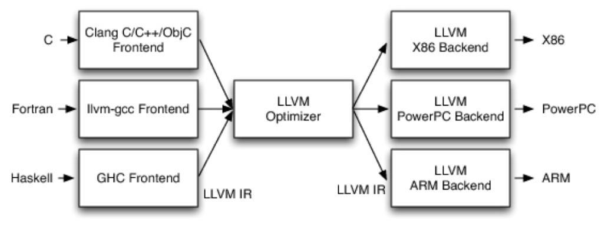

2. 自己实现一个IR

   感觉自己写工作量有点太大，或者是继续迁移中科大的代码完成IR的编写。

## 4.LLVM编译过程分析

我们以一个C语言为例，逐步分析LLVM的编译过程，代码如下：

```c
int n;
int fib(int p){
	int a;
	int b;
	int c;
	a = 0;
	b = 1;
	if ( p == 0 ){
		return 0;
	}
	if ( p == 1 ){
		return 1;
	}
	while ( p > 1 ){
		c = a + b;
		a = b;
		b = c;
		p = p - 1;
	}
	return c;
}
int main(){
	int res;
	res = fib( n );
	return res;
}
```


1. 输入文件并找到源文件

2. 预处理阶段，包括宏替换和头文件导入

   以上两步是很正常的步骤，因此不截图进行详细描述

3. 编译阶段，进行词法分析，语法分析，检测语法是否正确，并生成最终IR

   词法分析的结果如下：

   

   语法分析结果如下：

   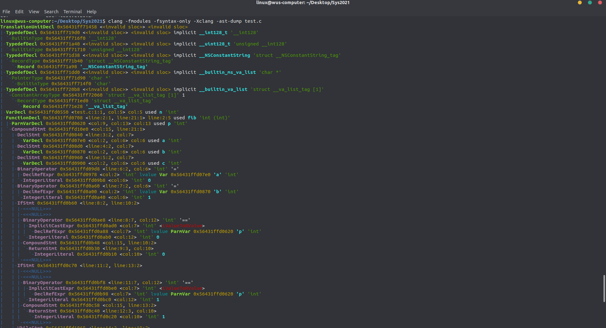

   

4. 生成IR中间代码：

   完成以上步骤后，就开始生成中间代码IR了，`代码生成器`（Code Generation）会将`语法树自顶向下遍历`逐步翻译成`LLVM IR`，

   ```
   ; ModuleID = 'test.c'
   source_filename = "test.c"
   target datalayout = "e-m:e-i64:64-f80:128-n8:16:32:64-S128"
   target triple = "x86_64-pc-linux-gnu"
   
   @n = common global i32 0, align 4
   
   ; Function Attrs: noinline nounwind optnone uwtable
   define i32 @fib(i32) #0 {
     %2 = alloca i32, align 4
     %3 = alloca i32, align 4
     %4 = alloca i32, align 4
     %5 = alloca i32, align 4
     %6 = alloca i32, align 4
     store i32 %0, i32* %3, align 4
     store i32 0, i32* %4, align 4
     store i32 1, i32* %5, align 4
     %7 = load i32, i32* %3, align 4
     %8 = icmp eq i32 %7, 0
     br i1 %8, label %9, label %10
   
   ; <label>:9:                                      ; preds = %1
     store i32 0, i32* %2, align 4
     br label %28
   
   ; <label>:10:                                     ; preds = %1
     %11 = load i32, i32* %3, align 4
     %12 = icmp eq i32 %11, 1
     br i1 %12, label %13, label %14
   
   ; <label>:13:                                     ; preds = %10
     store i32 1, i32* %2, align 4
     br label %28
   
   ; <label>:14:                                     ; preds = %10
     br label %15
   
   ; <label>:15:                                     ; preds = %18, %14
     %16 = load i32, i32* %3, align 4
     %17 = icmp sgt i32 %16, 1
     br i1 %17, label %18, label %26
   
   ; <label>:18:                                     ; preds = %15
     %19 = load i32, i32* %4, align 4
     %20 = load i32, i32* %5, align 4
     %21 = add nsw i32 %19, %20
     store i32 %21, i32* %6, align 4
     %22 = load i32, i32* %5, align 4
     store i32 %22, i32* %4, align 4
     %23 = load i32, i32* %6, align 4
     store i32 %23, i32* %5, align 4
     %24 = load i32, i32* %3, align 4
     %25 = sub nsw i32 %24, 1
     store i32 %25, i32* %3, align 4
     br label %15
   
   ; <label>:26:                                     ; preds = %15
     %27 = load i32, i32* %6, align 4
     store i32 %27, i32* %2, align 4
     br label %28
   
   ; <label>:28:                                     ; preds = %26, %13, %9
     %29 = load i32, i32* %2, align 4
     ret i32 %29
   }
   
   ; Function Attrs: noinline nounwind optnone uwtable
   define i32 @main() #0 {
     %1 = alloca i32, align 4
     %2 = alloca i32, align 4
     store i32 0, i32* %1, align 4
     %3 = load i32, i32* @n, align 4
     %4 = call i32 @fib(i32 %3)
     store i32 %4, i32* %2, align 4
     %5 = load i32, i32* %2, align 4
     ret i32 %5
   }
   
   attributes #0 = { noinline nounwind optnone uwtable "correctly-rounded-divide-sqrt-fp-math"="false" "disable-tail-calls"="false" "less-precise-fpmad"="false" "no-frame-pointer-elim"="true" "no-frame-pointer-elim-non-leaf" "no-infs-fp-math"="false" "no-jump-tables"="false" "no-nans-fp-math"="false" "no-signed-zeros-fp-math"="false" "no-trapping-math"="false" "stack-protector-buffer-size"="8" "target-cpu"="x86-64" "target-features"="+fxsr,+mmx,+sse,+sse2,+x87" "unsafe-fp-math"="false" "use-soft-float"="false" }
   
   !llvm.module.flags = !{!0}
   !llvm.ident = !{!1}
   
   !0 = !{i32 1, !"wchar_size", i32 4}
   !1 = !{!"clang version 6.0.0-1ubuntu2 (tags/RELEASE_600/final)"}
   ```

   当然，也可以进行一定的优化。LLVM的优化级别分别是`-O0 -O1 -O2 -O3 -Os`(第一个是大写英文字母O)

5. 后端：LLVM进行逐个PASS的优化，每个PASS做一些事情，最终生成汇编代码

   ```shell
   clang -S -fobjc-arc test.ll -o test.s
   ```

   生成的汇编代码如下

   ```
   	.text
   	.file	"test.c"
   	.globl	fib                     # -- Begin function fib
   	.p2align	4, 0x90
   	.type	fib,@function
   fib:                                    # @fib
   	.cfi_startproc
   # %bb.0:
   	pushq	%rbp
   	.cfi_def_cfa_offset 16
   	.cfi_offset %rbp, -16
   	movq	%rsp, %rbp
   	.cfi_def_cfa_register %rbp
   	movl	%edi, -8(%rbp)
   	movl	$0, -12(%rbp)
   	movl	$1, -16(%rbp)
   	cmpl	$0, -8(%rbp)
   	jne	.LBB0_2
   # %bb.1:
   	movl	$0, -4(%rbp)
   	jmp	.LBB0_8
   .LBB0_2:
   	cmpl	$1, -8(%rbp)
   	jne	.LBB0_4
   # %bb.3:
   	movl	$1, -4(%rbp)
   	jmp	.LBB0_8
   .LBB0_4:
   	jmp	.LBB0_5
   .LBB0_5:                                # =>This Inner Loop Header: Depth=1
   	cmpl	$1, -8(%rbp)
   	jle	.LBB0_7
   # %bb.6:                                #   in Loop: Header=BB0_5 Depth=1
   	movl	-12(%rbp), %eax
   	addl	-16(%rbp), %eax
   	movl	%eax, -20(%rbp)
   	movl	-16(%rbp), %eax
   	movl	%eax, -12(%rbp)
   	movl	-20(%rbp), %eax
   	movl	%eax, -16(%rbp)
   	movl	-8(%rbp), %eax
   	subl	$1, %eax
   	movl	%eax, -8(%rbp)
   	jmp	.LBB0_5
   .LBB0_7:
   	movl	-20(%rbp), %eax
   	movl	%eax, -4(%rbp)
   .LBB0_8:
   	movl	-4(%rbp), %eax
   	popq	%rbp
   	retq
   .Lfunc_end0:
   	.size	fib, .Lfunc_end0-fib
   	.cfi_endproc
                                           # -- End function
   	.globl	main                    # -- Begin function main
   	.p2align	4, 0x90
   	.type	main,@function
   main:                                   # @main
   	.cfi_startproc
   # %bb.0:
   	pushq	%rbp
   	.cfi_def_cfa_offset 16
   	.cfi_offset %rbp, -16
   	movq	%rsp, %rbp
   	.cfi_def_cfa_register %rbp
   	subq	$16, %rsp
   	movl	$0, -4(%rbp)
   	movl	n, %edi
   	callq	fib
   	movl	%eax, -8(%rbp)
   	movl	-8(%rbp), %eax
   	addq	$16, %rsp
   	popq	%rbp
   	retq
   .Lfunc_end1:
   	.size	main, .Lfunc_end1-main
   	.cfi_endproc
                                           # -- End function
   	.type	n,@object               # @n
   	.comm	n,4,4
   
   	.ident	"clang version 6.0.0-1ubuntu2 (tags/RELEASE_600/final)"
   	.section	".note.GNU-stack","",@progbits
   
   ```

6. 汇编代码生成目标文件

   目标文件的生成，是汇编器以`汇编代码作为插入`，将汇编代码`转换为机器代码`，最后输出目标文件

7. 链接需要的动态库和静态库，生成可执行文件

   链接主要是链接需要的动态库和静态库，生成可执行文件，其中

   - 静态库会和可执行文件合并
   - 动态库是独立的

8. 绑定，通过不同的架构，生成对应的可执行文件

   绑定主要是通过不同的架构，生成对应的mach-o格式可执行文件

综上，所述，LLVM的编译流程如下图所示

- 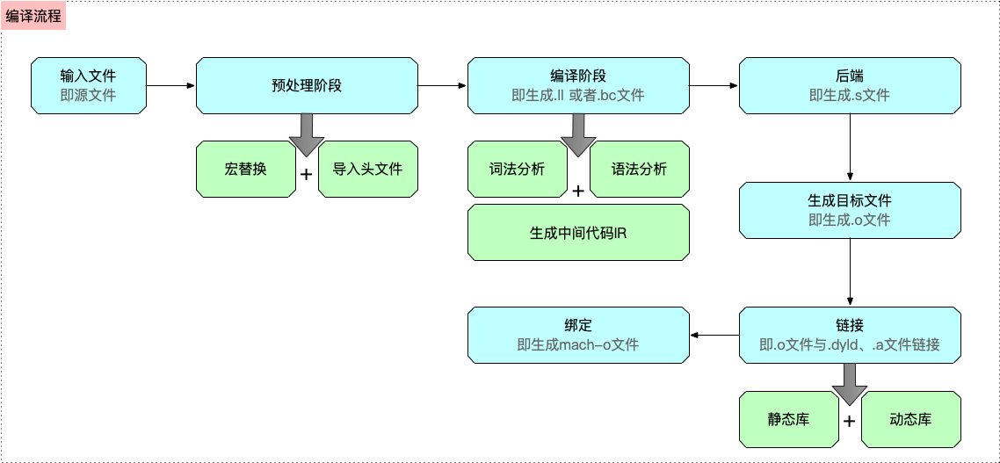

