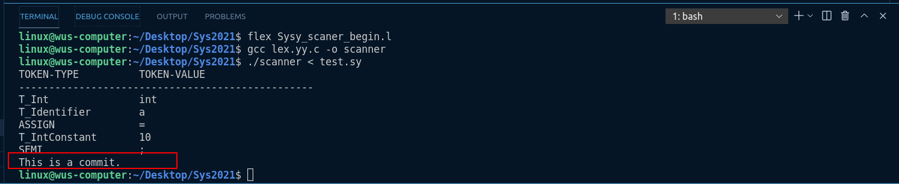
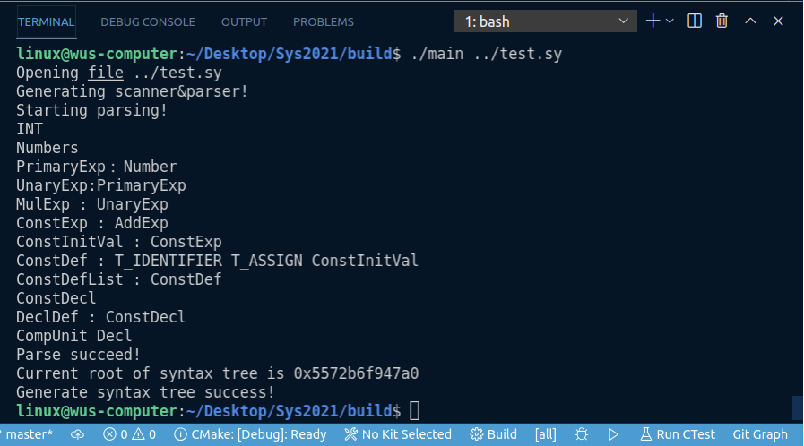
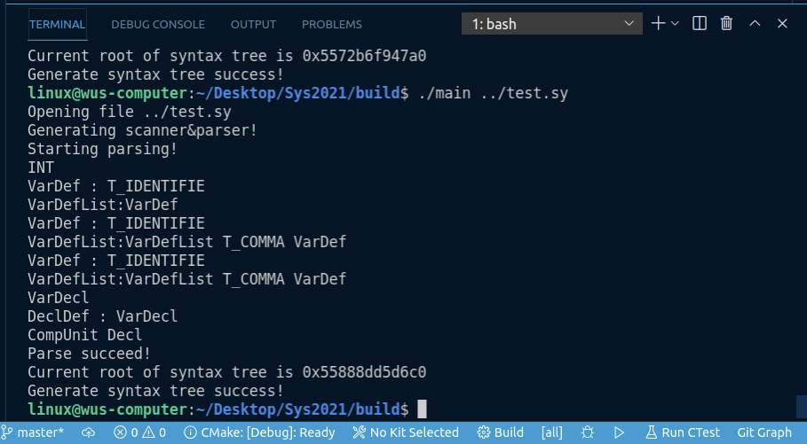
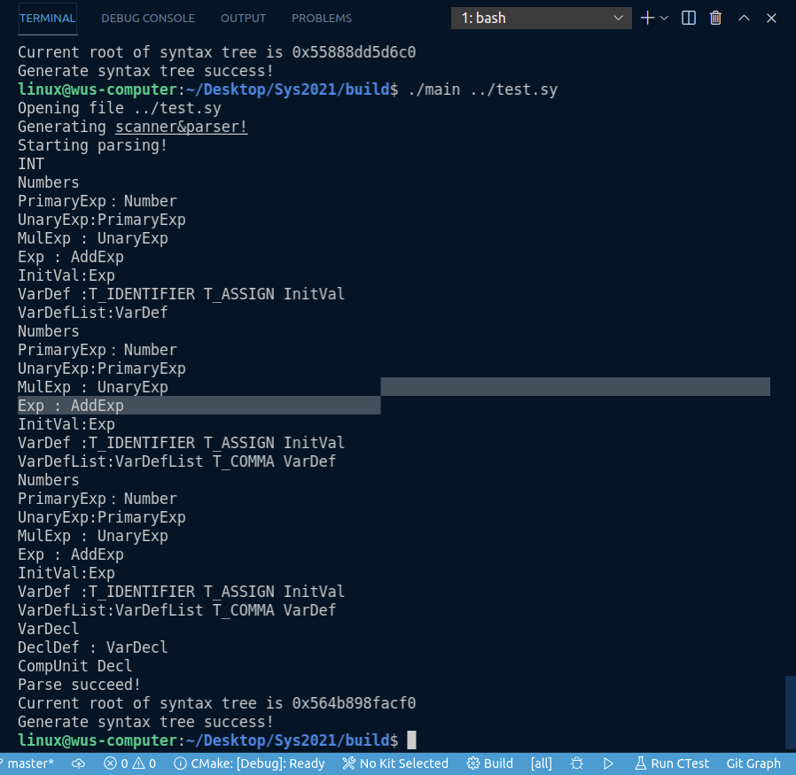
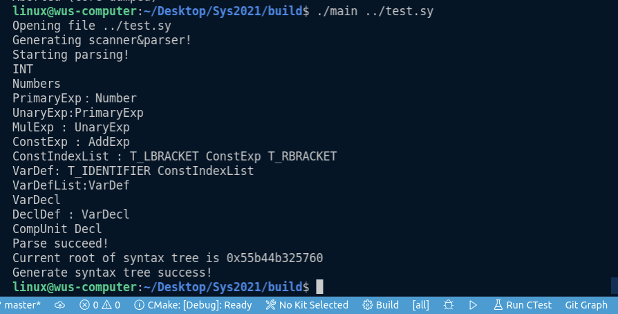
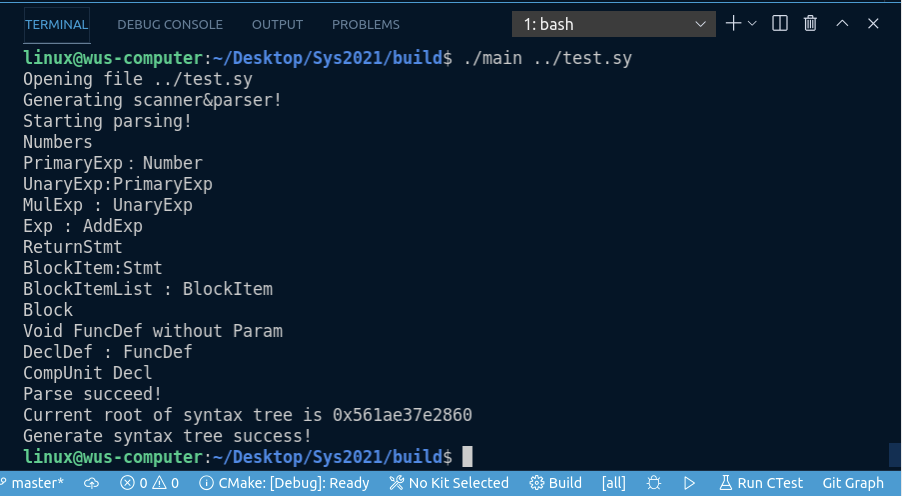
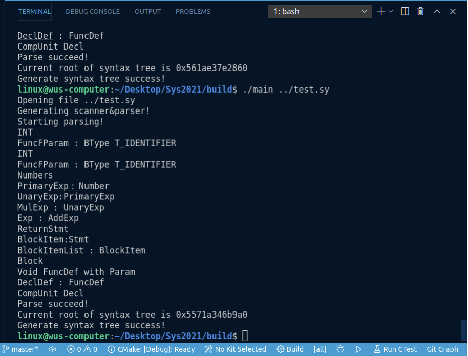
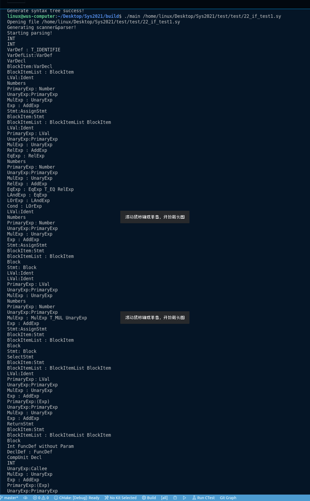
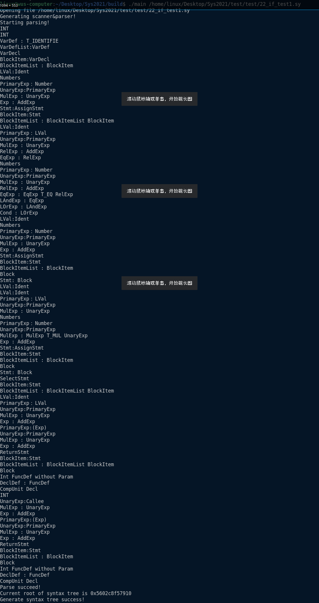
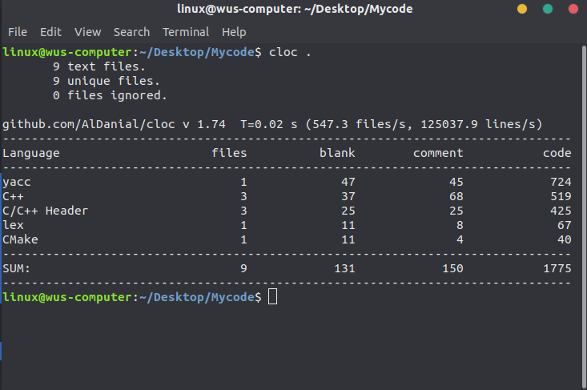

# 第二次试点班进度报告

## 一.进度总体情况

上周基本完成了词法分析器的实现，本周主要着力于语法分析以及语法树的建立。主要进行了以下工作：

1. 学习比赛参赛队伍的代码风格，重构上周的词法分析，将C语言版本迁移为 C++版本，并封装在Namespace中.
2. 增加了跳过多行注释的代码。
3. 初步完成利用bison工具进行语法分析，并建立语法树。

## 二.文法框架

选用SysY2021文法作为实现文法

文法的EBNF范式如下：

- 符号[...]表示方括号内包含的为可选项
- 符号{...}表示花括号内包含的为可重复 0 次或多次的项
- 终结符或者是由单引号括起的串,或者是 Ident、InstConst 这样的记号

SysY 语言的文法表示如下,其中 CompUnit 为开始符号:

编译单元		CompUnit →[ CompUnit ] ( Decl | FuncDef ) 

声明				Decl →ConstDecl | VarDecl 

常量声明		ConstDecl →'const' BType ConstDef { ',' ConstDef } ';' 

基本类型		BType →'int'

常数定义		ConstDef→Ident { '[' ConstExp ']' } '=' ConstInitVal 

常量初值		ConstInitVal→ConstExp   | '{' [ ConstInitVal { ',' ConstInitVal } ] '}'

变量声明		VarDecl →BType VarDef { ',' VarDef } ';' 

变量定义		VarDef →Ident { '[' ConstExp ']' } | Ident { '[' ConstExp ']' } '=' InitVal   

变量初值		InitVal→Exp | '{' [ InitVal { ',' InitVal } ] '}' 

函数定义		FuncDef →FuncType Ident '(' [FuncFParams] ')' Block 

函数类型		FuncType →'void' | 'int' 

函数形参表	FuncFParams→FuncFParam { ',' FuncFParam } 

函数形参		FuncFParam →BType Ident ['[' ']' { '[' Exp ']' }] 

语句块			Block →'{' { BlockItem } '}' 

语句块项		BlockItem →Decl | Stmt 

语句				Stmt →LVal '=' Exp ';' | [Exp] ';'  | Block | 'if' '( Cond ')' Stmt [ 'else' Stmt ] | 						'while' '(' Cond ')' Stmt | 'break' ';'    | 'continue' ';' | 'return' [Exp] ';' 

表达式			Exp →AddExp     注：SysY表达式是int型表达式

条件表达式	Cond →LOrExp

左值表达式	LVal →Ident {'[' Exp ']'} 

基本表达式	PrimaryExp→'(' Exp ')' | LVal | Number 

数值				Number→IntConst 

一元表达式	UnaryExp→PrimaryExp | Ident '(' [FuncRParams] ')'   | UnaryOp UnaryExp 

单目运算符	UnaryOp →'+' | '−' | '!'    注：'!'仅出现在条件表达式中

函数实参表	FuncRParams→Exp { ',' Exp } 

乘除模表达式MulExp→UnaryExp | MulExp ('*' | '/' | '%') UnaryExp 

加减表达式	AddExp→MulExp | AddExp ('+' | '−') MulExp 

关系表达式	RelExp→AddExp | RelExp ('<' | '>' | '<=' | '>=') AddExp

相等性表达式EqExp→RelExp | EqExp ('==' | '!=') RelExp 

逻辑与表达式LAndExp→EqExp | LAndExp '&&' EqExp 

逻辑或表达式LOrExp→LAndExp | LOrExp '||' LAndExp 

常量表达式	ConstExp→AddExp         注：使用的Ident必须是常量

## 三.测试案例展示

1. 补充多行注释的词法分析结果测试样例

   ```c++
   int a=10;
   /*
   INT
   */
   ```

   满足多行注释后的输出

   

   可以看到，之前未解决的多行注释问题也得到了解决

2. 常量定义的语法分析样例

   ```c++
   const int a=10;
   ```

   输出：

   

3. 变量声明的语法分析样例

   ```c++
   int a,b,c;
   ```

   输出：

   

4. 变量定义的语法分析样例

   ```c++
   int a=0,b=1,c=2;
   ```

   输出：

   

5. 数组的定义

   ```c++
   int a[100];
   ```

   输出：

   

   

6. 无参数函数定义分析样例

   ```c++
   void function()
   {
       return 0;
   }
   ```

   输出

   

7. 有参数函数分析样例

   ```c++
   void function(int a,int b)
   {
       return 0;
   }
   ```

   输出：

   

8. 选取几个完整测试样例进行测试

   样例1：

   ```c++
   // test if-else
   int ifElse() {
     int a;
     a = 5;
     if (a == 5) {
       a = 25;
     } else {
       a = a * 2;
     }
     return (a);
   }
   
   
   int main() {
     return (ifElse());
   }
   
   ```

   输出：

   

   样例2：

   ```c++
   int doubleWhile() {
     int i;
     i = 5;
     int j;
     j = 7;
     while (i < 100) {
       i = i + 30;
       while(j < 100){
         j = j + 6;
       }
       j = j - 100;
     }
     return (j);
   }
   
   int main() {
     return doubleWhile();
   }
   
   ```

   输出：

   

   可以看到，我们的语法分析基本可以对所有文件进行一个正确的语法分析以及语法树的建立。

## 四.已实现的功能

1. 已完成词法分析功能，可以正确的对Sysy2021的测试样例进行词法分析。
2. 基本完成语法分析中语法树的建立

## 五.代码行数统计

目前总代码量（使用Cloc工具统计）



## 六.附件

SysY2021语法分析文件关键代码

```c++
%{
#include <iostream>
#include <memory>
#include <sysyFlexLexer.hh>
using namespace std;

#undef yylex
#define yylex scanner->yylex

std::shared_ptr<SyntaxCompUnit> rootFromParser;
%}

%language "c++"
%defines "./build/sysy_parser.hh"
%output "./build/sysy_parser.cc"

%locations
%define parser_class_name {sysy_parser}
%define api.value.type variant
%parse-param {sysyFlexLexer* scanner}
%define parse.trace

%require "3.2"

%code requires{
#define YYLTYPE
#include <syntax_tree.hh>
#include <string>
class sysy_driver;
namespace yy 
{
    class sysyFlexLexer;
}
}

%token T_END
%token T_ERROR
%token T_ADD
%token T_SUB
%token T_MUL
%token T_DIV
%token T_MOD
%token T_LT
%token T_LTE
%token T_GT
%token T_GTE
%token T_EQ
%token T_NEQ
%token T_ASSIGN
%token T_SEMICOLIN
%token T_COMMA
%token T_LPARENTHESE
%token T_RPARENTHESE
%token T_LBRACKET
%token T_RBRACKET
%token T_LBRACE
%token T_RBRACE
%token T_ELSE
%token T_IF
%token T_INT
%token T_VOID
%token T_RETURN
%token T_WHILE
%token <std::string> T_IDENTIFIER
%token <int> T_NUMBER
//not implemented in .l
%token T_ARRAY
%token T_LETTER
//end not
%token T_EOL

%token T_COMMENT
%token T_BLANK
%token T_CONST
%token T_BREAK
%token T_CONTINUE
%token T_NOT
%token T_AND
%token T_OR

//%type <SyntaxTreeNode>
//shared_ptr 智能指针类
%type <std::shared_ptr<SyntaxCompUnit>>			CompUnit;//编译单元
%type <std::shared_ptr<SyntaxDeclDef>> 			DeclDef;//声明		
%type <std::shared_ptr<SyntaxConstDecl>>		ConstDecl;//常量声明（const）
%type <std::shared_ptr<SyntaxConstDefList>>		ConstDefList;//常量链表定义
%type <std::shared_ptr<SyntaxConstDef>>			ConstDef;//常数定义
%type <std::shared_ptr<SyntaxArrayConstExpList>>	ConstIndexList;//常量数组定义
%type <std::shared_ptr<SyntaxConstInitVal>>		ConstInitVal;//常量初值
%type <std::shared_ptr<SyntaxConstInitValList>>  	ConstInitValList;//常量初始化链表定义
%type <std::shared_ptr<SyntaxVarDecl>>			VarDecl;//变量声明
%type <std::shared_ptr<SyntaxVarDefList>>		VarDefList;//变量链表声明
%type <std::shared_ptr<SyntaxVarDef>>			VarDef;//变量定义
%type <std::shared_ptr<SyntaxInitVal>>         		InitVal;//变量初值
%type <std::shared_ptr<SyntaxInitValList>>        	InitValList;//变量数组初值
%type <std::shared_ptr<SyntaxFuncDef>>         		FuncDef;//函数定义
%type <std::shared_ptr<SyntaxFuncFParamList>>         	FuncFParams;//函数形参表
%type <std::shared_ptr<SyntaxFuncFParam>>		FuncFParam;//函数形参
%type <std::shared_ptr<SyntaxParamArrayExpList>>	IndexList;//变量数组定义
%type <std::shared_ptr<SyntaxBlock>>			Block;//语句块
%type <std::shared_ptr<SyntaxBlockItemList>>         	BlockItemList;//语句块项
%type <std::shared_ptr<SyntaxBlockItem>>         	BlockItem;//语句块项
%type <std::shared_ptr<SyntaxStmt>>         		Stmt;//语句

%type <std::shared_ptr<SyntaxAssignStmt>>			AssignStmt;//赋值语句
%type <std::shared_ptr<SyntaxSelectStmt>>			SelectStmt;//if_else
%type <std::shared_ptr<SyntaxBreakStmt>>         	BreakStmt;//break
%type <std::shared_ptr<SyntaxContinueStmt>>	        ContinueStmt;//continue
%type <std::shared_ptr<SyntaxIterationStmt>>		IterationStmt;
%type <std::shared_ptr<SyntaxReturnStmt>>         	ReturnStmt;//return 

%type <std::shared_ptr<SyntaxExp>>					Exp;//表达式
%type <std::shared_ptr<SyntaxCond>>         		Cond;//条件表达式
%type <std::shared_ptr<SyntaxLVal>>         		LVal;//左值表达式
%type <std::shared_ptr<SyntaxPrimaryExp>>       	PrimaryExp;//基本表达式
%type <std::shared_ptr<SyntaxNumber>>         		Number;//数值
%type <std::shared_ptr<SyntaxUnaryExp>>         	UnaryExp; //一元表达式
%type <std::shared_ptr<SyntaxExpList>>         		FuncRParams;//函数实参表

%type <std::shared_ptr<SyntaxCallee>>			Callee;
%type <std::shared_ptr<SyntaxMulExp>>			MulExp;//乘除模表达式
%type <std::shared_ptr<SyntaxAddExp>>         		AddExp;//加减表达式
%type <std::shared_ptr<SyntaxRelExp>>         		RelExp;//关系表达式
%type <std::shared_ptr<SyntaxEqExp>>         		EqExp;//相等性表达式
%type <std::shared_ptr<SyntaxLAndExp>>         		LAndExp;//逻辑与表达式
%type <std::shared_ptr<SyntaxLOrExp>>         		LOrExp;//逻辑或表达式
%type <std::shared_ptr<SyntaxConstExp>>                 ConstExp;//常量表达式
%type <type_specifier>					BType;
%type <type_specifier>					FuncType;
%type <unaryop>						UnaryOp;

%start CompUnit //开始符号

//语法规则部分
%%
// 编译单元 CompUnit -> [ CompUnit ] ( Decl | FuncDef )
CompUnit : DeclDef {
	$$=std::make_shared<SyntaxCompUnit>();
	$$->DeclDefList.emplace_back(std::move($1));
	rootFromParser=$$;
	std::cout<<"CompUnit Decl"<<std::endl;

    }
    | CompUnit DeclDef {
	$1->DeclDefList.emplace_back(std::move($2));
	$$=std::move($1);
	rootFromParser=$$;
	std::cout<<"CompUnit Decl"<<std::endl;

    }
    | CompUnit T_END {
    	$$=std::move($1);
    	rootFromParser=$$;
    	return 0;
    }
    ;
// 声明 Decl -> ConstDecl | VarDecl
DeclDef : ConstDecl{
	$$=std::make_shared<SyntaxDeclDef>();
	$$->ConstDecl=std::move($1);
	std::cout<<"DeclDef : ConstDecl"<<std::endl;
    }
    | VarDecl{
	$$=std::make_shared<SyntaxDeclDef>();
    $$->VarDecl=std::move($1);
	std::cout<<"DeclDef : VarDecl"<<std::endl;
    }
    | FuncDef{
    $$=std::make_shared<SyntaxDeclDef>();
	$$->FuncDef=std::move($1);
	std::cout<<"DeclDef : FuncDef"<<std::endl;
    }
    ;
// 常量声明 ConstDecl -> 'const' BType ConstDef { ',' ConstDef } tSEMI
ConstDecl : T_CONST BType ConstDefList T_SEMICOLIN {
	$$=std::make_shared<SyntaxConstDecl>();
	// Assume that the memory of 'ConstDefList' won't be released
	// Here we copy pointers
	$$->ConstDefList=$3->list;
	std::cout<<"ConstDecl"<<std::endl;
    }
    ;
//常量连续定义（常数链表）
ConstDefList : ConstDef  {
	$$=std::make_shared<SyntaxConstDefList>();
	$$->list.emplace_back(std::move($1));
	std::cout<<"ConstDefList : ConstDef"<<std::endl;
    }
    | ConstDefList T_COMMA ConstDef {
    	$1->list.emplace_back(std::move($3));
    	$$=std::move($1);
		std::cout<<"ConstDefList : ConstDefList T_COMMA ConstDef"<<std::endl;
    }
    ;
// 常量数组定义
ConstIndexList : T_LBRACKET ConstExp T_RBRACKET {
	$$=std::make_shared<SyntaxArrayConstExpList>();
	$$->list.emplace_back(std::move($2));
	std::cout<<"ConstIndexList : T_LBRACKET ConstExp T_RBRACKET"<<std::endl;
    }
    | ConstIndexList T_LBRACKET ConstExp T_RBRACKET {
    	$1->list.emplace_back(std::move($3));
    	$$=std::move($1);
		std::cout<<"ConstIndexList T_LBRACKET ConstExp T_RBRACKET"<<std::endl;
		
    }
    ;
//BType →'int'
BType : T_INT {
	$$=TYPE_INT;
	std::cout<<"INT"<<std::endl;
    }
    ;
// 常数定义 ConstDef→Ident { '[' ConstExp ']' } '=' ConstInitVal
ConstDef : T_IDENTIFIER T_ASSIGN ConstInitVal {
    	$$=std::make_shared<SyntaxConstDef>();
    	$$->ConstInitVal=std::move($3);
    	$$->id=$1;
		std::cout<<"ConstDef : T_IDENTIFIER T_ASSIGN ConstInitVal"<<std::endl;
    }
    | T_IDENTIFIER ConstIndexList T_ASSIGN ConstInitVal {
    	$$=std::make_shared<SyntaxConstDef>();
		$$->ConstInitVal=std::move($4);
		$$->id=$1;
		$$->ArrayConstExpList=$2->list;
		std::cout<<"ConstDef : T_IDENTIFIER ConstIndexList T_ASSIGN ConstInitVal"<<std::endl;
    }
    ;

// 常量初值链表（连续初始化常量） ConstInitValList -> ConstInitVal { ',' ConstInitVal }
ConstInitValList : ConstInitVal {
		$$=std::make_shared<SyntaxConstInitValList>();
		$$->list.emplace_back(std::move($1));
		std::cout<<"ConstInitValList : ConstInitVal"<<std::endl;
    }
    | ConstInitValList T_COMMA ConstInitVal {
    	$1->list.emplace_back(std::move($3));
    	$$=std::move($1);
		std::cout<<"ConstInitValList : ConstInitValList T_COMMA ConstInitVa"<<std::endl;
    }
    ;

// 常量初始化 ConstInitVal→ConstExp   | '{' [ ConstInitVal { ',' ConstInitVal } ] '}
ConstInitVal : ConstExp {
		$$=std::make_shared<SyntaxConstInitVal>();
		$$->ConstExp=std::move($1);
		std::cout<<"ConstInitVal : ConstExp"<<endl;
    }
    | T_LBRACE  T_RBRACE {

    }
    | T_LBRACE ConstInitValList T_RBRACE {
    	$$=std::make_shared<SyntaxConstInitVal>();
        $$->ConstInitValList=$2->list;
		std::cout<<"ConstInitVal : T_LBRACE ConstInitValList T_RBRACE"<<endl;
    }
    ;

// 变量声明 VarDecl →BType VarDef { ',' VarDef } ';' 
VarDecl : BType VarDefList T_SEMICOLIN {
		$$=std::make_shared<SyntaxVarDecl>();
		$$->type=$1;
		$$->VarDefList=$2->list;
		std::cout<<"VarDecl"<<std::endl;
    }
    ;
//变量定义VarDef →Ident { '[' ConstExp ']' } | Ident { '[' ConstExp ']' } '=' InitVal
VarDef : T_IDENTIFIER  {
		$$=std::make_shared<SyntaxVarDef>();
		$$->id=$1;
		std::cout<<"VarDef : T_IDENTIFIE"<<std::endl;
    }
    | T_IDENTIFIER T_ASSIGN InitVal {
		$$=std::make_shared<SyntaxVarDef>();
		$$->id=$1;
		$$->InitVal=std::move($3);
		std::cout<<"VarDef :T_IDENTIFIER T_ASSIGN InitVal "<<std::endl;
    }
    | T_IDENTIFIER ConstIndexList  {

    	$$=std::make_shared<SyntaxVarDef>();
		$$->id=$1;
		$$->ArrayConstExpList=$2->list;
		std::cout<<"VarDef: T_IDENTIFIER ConstIndexList"<<std::endl;
    }
    | T_IDENTIFIER ConstIndexList T_ASSIGN InitVal {
    	$$=std::make_shared<SyntaxVarDef>();
		$$->id=$1;
		$$->ArrayConstExpList=$2->list;
		$$->InitVal=std::move($4);
		std::cout<<"VarDef: T_IDENTIFIER ConstIndexList T_ASSIGN InitVal"<<std::endl;
    }
    ;

// 变量连续声明（变量链表） VarDefList -> VarDef { ',' VarDef }
VarDefList : VarDef {
		$$=std::make_shared<SyntaxVarDefList>();
		$$->list.emplace_back(std::move($1));
		std::cout<<"VarDefList:VarDef"<<std::endl;
    }
    | VarDefList T_COMMA VarDef {
    	$1->list.emplace_back(std::move($3));
    	$$=std::move($1);
		std::cout<<"VarDefList:VarDefList T_COMMA VarDef "<<std::endl;
    }
    ;

//变量初值 InitVal→Exp | '{' [ InitVal { ',' InitVal } ] '}'
InitVal : Exp {
	$$=std::make_shared<SyntaxInitVal>();
	$$->Exp=std::move($1);
	std::cout<<"InitVal:Exp"<<std::endl;
    }
    | T_LBRACE  T_RBRACE {
	std::cout<<"{}"<<std::endl;
    }
    | T_LBRACE InitValList T_RBRACE {
    $$=std::make_shared<SyntaxInitVal>();
	$$->InitValList=$2->list;
	std::cout<<"InitVal: { InitValList }"<<std::endl;
    }
    ;

//变量初值链表 InitValList-> InitVal { ',' InitVal }
InitValList : InitVal {
	$$=std::make_shared<SyntaxInitValList>();
	$$->list.emplace_back(std::move($1));
	std::cout<<"InitValList : InitVal"<<std::endl;
    }
    | InitValList T_COMMA InitVal {
	$1->list.emplace_back(std::move($3));
	$$=std::move($1);
	std::cout<<"InitValList T_COMMA InitVal"<<std::endl;
    }
    ;

//数组
IndexList : T_LBRACKET Exp T_RBRACKET {
	//一维数组
	$$=std::make_shared<SyntaxParamArrayExpList>();
	$$->list.emplace_back(std::move($2));
	std::cout<<"One IndexList"<<std::endl;
    }
    | IndexList T_LBRACKET Exp T_RBRACKET {
    	//多维数组
		$1->list.emplace_back(std::move($3));
    	$$=std::move($1);
		std::cout<<"Muti IndexList"<<std::endl;
    }
    ;
//函数定义 FuncDef →FuncType Ident '(' [FuncFParams] ')' Block
FuncDef : FuncType T_IDENTIFIER T_LPARENTHESE T_RPARENTHESE Block {
	//不带参数的返回类型为Void的函数
	$$=std::make_shared<SyntaxFuncDef>();
	$$->type=$1;
	$$->id=$2;
	$$->Block=std::move($5);
	std::cout<<"Void FuncDef without Param"<<std::endl;
    }
    | FuncType T_IDENTIFIER T_LPARENTHESE FuncFParams T_RPARENTHESE Block {
	//带有参数的返回值为Void的函数
	$$=std::make_shared<SyntaxFuncDef>();
	$$->type=$1;
	$$->id=$2;
	$$->Block=std::move($6);
	$$->FuncFParamList=$4->list;
	std::cout<<"Void FuncDef with Param"<<std::endl;
    }
    | BType T_IDENTIFIER T_LPARENTHESE  T_RPARENTHESE Block {
    //无参数的返回值为int的函数
	$$=std::make_shared<SyntaxFuncDef>();
	$$->type=$1;
	$$->id=$2;
	$$->Block=std::move($5);
	std::cout<<"Int FuncDef without Param"<<std::endl;
    }
    | BType T_IDENTIFIER T_LPARENTHESE FuncFParams T_RPARENTHESE Block {
    $$=std::make_shared<SyntaxFuncDef>();
    $$->type=$1;
    $$->id=$2;
    $$->Block=std::move($6);
    $$->FuncFParamList=$4->list;
	std::cout<<"Int FuncDef with Param"<<std::endl;
    }
    ;

FuncType : T_VOID  {
	$$=TYPE_VOID;
    }
    ;
//函数参数表
FuncFParams :   FuncFParam  {
	$$=std::make_shared<SyntaxFuncFParamList>();
	$$->list.emplace_back($1);
    }
    | FuncFParams T_COMMA FuncFParam {
    	$1->list.emplace_back(std::move($3));
    	$$=std::move($1);
    }
    ;

//函数参数
FuncFParam : BType T_IDENTIFIER  {
	$$=std::make_shared<SyntaxFuncFParam>();
	$$->type=$1;
	$$->id=$2;
	std::cout<<"FuncFParam : BType T_IDENTIFIER"<<std::endl;
    }
    | BType T_IDENTIFIER T_LBRACKET T_RBRACKET {
    $$=std::make_shared<SyntaxFuncFParam>();
	$$->type=$1;
	$$->id=$2;
	$$->isarray=true;
	std::cout<<"FuncFParam : BType T_IDENTIFIER T_LBRACKET T_RBRACKET"<<std::endl;
    }
    | BType T_IDENTIFIER T_LBRACKET T_RBRACKET IndexList  {
    $$=std::make_shared<SyntaxFuncFParam>();
	$$->type=$1;
	$$->id=$2;
	$$->isarray=true;
	$$->ParamArrayExpList=$5->list;
	std::cout<<"FuncFParam : BType T_IDENTIFIER T_LBRACKET T_RBRACKET IndexList"<<std::endl;
    }
    | BType T_IDENTIFIER T_LBRACKET Exp T_RBRACKET IndexList  {
	$$=std::make_shared<SyntaxFuncFParam>();
	$$->type=$1;
	$$->id=$2;
	$$->isarray=true;
	$$->ParamArrayExpList=$6->list;
	std::cout<<"FuncFParam : BType T_IDENTIFIER T_LBRACKET Exp T_RBRACKET IndexList"<<std::endl;
    }
    ;
//语句块 Block -> '{' { BlockItem } '}'
Block : T_LBRACE T_RBRACE {
	
    }
    | T_LBRACE BlockItemList T_RBRACE {
    	$$=std::make_shared<SyntaxBlock>();
    	$$->BlockItemList=$2->list;
    	std::cout<<"Block"<<std::endl;
    }
    ;
//BlockItemList -> { BlockItem }
BlockItemList : BlockItem {
	$$=std::make_shared<SyntaxBlockItemList>();
	$$->list.emplace_back(std::move($1));
	std::cout<<"BlockItemList : BlockItem "<<std::endl;
    }
    | BlockItemList BlockItem{
    $1->list.emplace_back(std::move($2));
    $$=std::move($1);
	std::cout<<"BlockItemList : BlockItemList BlockItem"<<std::endl;
    }
    ;
//BlockItem -> ConstDecl | VarDecl | Stmt
BlockItem: ConstDecl {
	$$=std::make_shared<SyntaxBlockItem>();
	$$->ConstDecl=std::move($1);
	std::cout<<"BlockItem: ConstDecl"<<std::endl;
    }
    |
    VarDecl {
    $$=std::make_shared<SyntaxBlockItem>();
	$$->VarDecl=std::move($1);
	std::cout<<"BlockItem:VarDecl"<<std::endl;
    }
    | Stmt {
    $$=std::make_shared<SyntaxBlockItem>();
	$$->Stmt=std::move($1);
	std::cout<<"BlockItem:Stmt"<<std::endl;
    }
    ;


Stmt : BreakStmt T_SEMICOLIN  {
	$$=std::make_shared<SyntaxStmt>();
	$$->BreakStmt=std::move($1);
	std::cout<<"Stmt:break"<<std::endl;
    }
    | ContinueStmt T_SEMICOLIN {
    	$$=std::make_shared<SyntaxStmt>();
    	$$->ContinueStmt=std::move($1);
		std::cout<<"Stmt:Continue"<<std::endl;
    }
    | AssignStmt {
    	$$=std::make_shared<SyntaxStmt>();
    	$$->AssignStmt=std::move($1);
		std::cout<<"Stmt:AssignStmt"<<std::endl;
    }
    | Exp T_SEMICOLIN {
    	$$=std::make_shared<SyntaxStmt>();
		$$->Exp=std::move($1);
		std::cout<<"Stmt:Exp T_SEMICOLIN"<<std::endl;
    }
    | T_SEMICOLIN {
    }
    | Block {
    	$$=std::make_shared<SyntaxStmt>();
		$$->Block=std::move($1);
		std::cout<<"Stmt: Block"<<std::endl;
    }
    | SelectStmt {
    	$$=std::make_shared<SyntaxStmt>();
		$$->SelectStmt=std::move($1);
		std::cout<<"SelectStmt"<<std::endl;
    }
    | IterationStmt {
    	$$=std::make_shared<SyntaxStmt>();
		$$->IterationStmt=std::move($1);
		std::cout<<"IterationStmt"<<std::endl;
    }
    | ReturnStmt {
    	$$=std::make_shared<SyntaxStmt>();
		$$->ReturnStmt=std::move($1);
		std::cout<<"ReturnStmt"<<std::endl;
    }
    ;

BreakStmt : T_BREAK {
	$$=std::make_shared<SyntaxBreakStmt>();
    }
    ;
ContinueStmt : T_CONTINUE {
	$$=std::make_shared<SyntaxContinueStmt>();
    }
    ;
AssignStmt : LVal T_ASSIGN Exp T_SEMICOLIN{
	$$=std::make_shared<SyntaxAssignStmt>();
	$$->LVal=std::move($1);
    }
    ;

SelectStmt : T_IF T_LPARENTHESE Cond T_RPARENTHESE Stmt {
	$$=std::make_shared<SyntaxSelectStmt>();
	$$->Cond=std::move($3);
	$$->ifStmt=std::move($5);
    }
    | T_IF T_LPARENTHESE Cond T_RPARENTHESE Stmt T_ELSE Stmt {
    	$$=std::make_shared<SyntaxSelectStmt>();
    	$$->Cond=std::move($3);
    	$$->ifStmt=std::move($5);
    	$$->elseStmt=std::move($7);
    }
    ;

IterationStmt : T_WHILE T_LPARENTHESE Cond T_RPARENTHESE Stmt {
	$$=std::make_shared<SyntaxIterationStmt>();
	$$->Cond=std::move($3);
	$$->Stmt=std::move($5);
    }
    ;
ReturnStmt : T_RETURN T_SEMICOLIN {
	$$=std::make_shared<SyntaxReturnStmt>();
    }
    | T_RETURN Exp T_SEMICOLIN {
	$$=std::make_shared<SyntaxReturnStmt>();
	$$->Exp=std::move($2);
    }
    ;

Exp : AddExp {
	$$=std::make_shared<SyntaxExp>();
	$$->AddExp=std::move($1);
	std::cout<<"Exp : AddExp"<<std::endl;
    }
    ;

Cond : LOrExp {
	$$=std::make_shared<SyntaxCond>();
	$$->LOrExp=std::move($1);
	std::cout<<"Cond : LOrExp"<<std::endl;
    }
    ;
// 左值表达式 LVal -> Ident {'[' Exp ']'}
LVal : T_IDENTIFIER {
	$$=std::make_shared<SyntaxLVal>();
	$$->id=$1;
	std::cout<<"LVal:Ident"<<std::endl;
    }
    | T_IDENTIFIER IndexList {
	$$=std::make_shared<SyntaxLVal>();
	$$->id=$1;
	$$->ArrayExpList=$2->list;
	std::cout<<"LVal:T_IDENTIFIER IndexList"<<std::endl;
    }
    ;
//基本表达式
PrimaryExp : T_LPARENTHESE Exp T_RPARENTHESE {
	$$=std::make_shared<SyntaxPrimaryExp>();
	$$->Exp=std::move($2);
	std::cout<<"PrimaryExp:(Exp)"<<std::endl;
    }
    | LVal {
    $$=std::make_shared<SyntaxPrimaryExp>();
	$$->LVal=std::move($1);
    std::cout<<"PrimaryExp：LVal"<<std::endl;
	}
    | Number {
    $$=std::make_shared<SyntaxPrimaryExp>();
	$$->Number=std::move($1);
    std::cout<<"PrimaryExp：Number"<<std::endl;
	}
    ;

Number : T_NUMBER {
	$$=std::make_shared<SyntaxNumber>();
	$$->num=$1;
    std::cout<<"Numbers"<<std::endl;
	}
    ;

//一元表达式
UnaryExp : PrimaryExp {
	$$=std::make_shared<SyntaxUnaryExp>();
	$$->PrimaryExp=std::move($1);
	std::cout<<"UnaryExp:PrimaryExp"<<std::endl;
    }
    | Callee {
    $$=std::make_shared<SyntaxUnaryExp>();
	$$->Callee=std::move($1);
	std::cout<<"UnaryExp:Callee"<<std::endl;
    }
    | UnaryOp UnaryExp {
    $$=std::make_shared<SyntaxUnaryExp>();
	$$->UnaryExp=std::move($2);
	$$->op=$1;
    std::cout<<"UnaryExp:UnaryOp UnaryExp "<<std::endl;
	}
    ;

Callee : T_IDENTIFIER T_LPARENTHESE T_RPARENTHESE {
	$$=std::make_shared<SyntaxCallee>();
	$$->id=$1;
    }
    | T_IDENTIFIER T_LPARENTHESE FuncRParams T_RPARENTHESE {
	$$=std::make_shared<SyntaxCallee>();
	$$->id=$1;
	$$->ExpList=$3->list;
	}
    ;

// operand passes to UnaryExp as a attribute
UnaryOp : T_ADD {
	$$=OP_POS;
	std::cout<<"+"<<std::endl;
    }
    | T_SUB {
    $$=OP_NEG;
    std::cout<<"-"<<std::endl;
	}
    | T_NOT {
    $$=OP_NOT;
    std::cout<<"！"<<std::endl;
	}
    ;

FuncRParams : Exp {
	$$=std::make_shared<SyntaxExpList>();
	$$->list.emplace_back(std::move($1));
    std::cout<<"FuncRParams : Exp "<<std::endl;
	}
    | FuncRParams T_COMMA Exp {
    $1->list.emplace_back(std::move($3));
    $$=std::move($1);
    std::cout<<"FuncRParams :Exp,Exp"<<std::endl;
	}
    ;
//乘除模表达式MulExp→UnaryExp | MulExp ('*' | '/' | '%') UnaryExp
MulExp : UnaryExp {
	$$=std::make_shared<SyntaxMulExp>();
	$$->UnaryExp=std::move($1);
	std::cout<<"MulExp : UnaryExp"<<std::endl;
    }
    | MulExp T_MUL UnaryExp {
	$$=std::make_shared<SyntaxMulExp>();
	$$->MulExp=std::move($1);
	$$->UnaryExp=std::move($3);
	$$->op=OP_MUL;
	std::cout<<"MulExp : MulExp T_MUL UnaryExp"<<std::endl;
    }
    | MulExp T_DIV UnaryExp {
	$$=std::make_shared<SyntaxMulExp>();
	$$->MulExp=std::move($1);
	$$->UnaryExp=std::move($3);
	$$->op=OP_DIV;
	std::cout<<"MulExp : MulExp T_DIV UnaryExp"<<std::endl;
    }
    | MulExp T_MOD UnaryExp {
	$$=std::make_shared<SyntaxMulExp>();
	$$->MulExp=std::move($1);
	$$->UnaryExp=std::move($3);
	$$->op=OP_MOD;
	std::cout<<"MulExp :MulExp T_MOD UnaryExp"<<std::endl;
    }
    ;
//加减表达式AddExp→MulExp | AddExp ('+' | '−') MulExp 
AddExp : MulExp {
	$$=std::make_shared<SyntaxAddExp>();
	$$->MulExp=std::move($1);
    //std::cout<<""<<std::endl;
	}
    | AddExp T_ADD MulExp {
   	$$=std::make_shared<SyntaxAddExp>();
   	$$->AddExp=std::move($1);
   	$$->MulExp=std::move($3);
   	$$->op=OP_PLUS;
	//std::cout<<""<<std::endl;
    }
    | AddExp T_SUB MulExp {
	$$=std::make_shared<SyntaxAddExp>();
	$$->AddExp=std::move($1);
	$$->MulExp=std::move($3);
	$$->op=OP_MINUS;
	//std::cout<<""<<std::endl;
    }
    ;

RelExp : AddExp	{
	$$=std::make_shared<SyntaxRelExp>();
	$$->AddExp=std::move($1);
	std::cout<<"RelExp : AddExp	"<<std::endl;
    }
    | RelExp T_LT AddExp {
	$$=std::make_shared<SyntaxRelExp>();
	$$->RelExp=std::move($1);
	$$->AddExp=std::move($3);
	$$->op=OP_LT;
	std::cout<<"RelExp : RelExp T_LT AddExp	"<<std::endl;
    }
    | RelExp T_GT AddExp {
  	$$=std::make_shared<SyntaxRelExp>();
  	$$->RelExp=std::move($1);
  	$$->AddExp=std::move($3);
  	$$->op=OP_GT;
	std::cout<<"RelExp : RelExp T_GT AddExp"<<std::endl;
    }
    | RelExp T_LTE AddExp {
	$$=std::make_shared<SyntaxRelExp>();
	$$->RelExp=std::move($1);
	$$->AddExp=std::move($3);
	$$->op=OP_LTE;
	std::cout<<"RelExp : RelExp T_LTE AddExp"<<std::endl;
    }
    | RelExp T_GTE AddExp {
	$$=std::make_shared<SyntaxRelExp>();
	$$->RelExp=std::move($1);
	$$->AddExp=std::move($3);
	$$->op=OP_GTE;
	std::cout<<"RelExp : RelExp T_GTE AddExp"<<std::endl;
    }
    ;

EqExp : RelExp {
	$$=std::make_shared<SyntaxEqExp>();
	$$->RelExp=std::move($1);
	std::cout<<"EqExp : RelExp"<<std::endl;
    }
    | EqExp T_EQ RelExp {
	$$=std::make_shared<SyntaxEqExp>();
	$$->EqExp=std::move($1);
	$$->RelExp=std::move($3);
	$$->op=OP_EQ;
	std::cout<<"EqExp : EqExp T_EQ RelExp"<<std::endl;
    }
    | EqExp T_NEQ RelExp {
	$$=std::make_shared<SyntaxEqExp>();
	$$->EqExp=std::move($1);
	$$->RelExp=std::move($3);
	$$->op=OP_NEQ;
	std::cout<<"EqExp : EqExp T_NEQ RelExp"<<std::endl;
    }
    ;

LAndExp : EqExp {
	$$=std::make_shared<SyntaxLAndExp>();
	$$->EqExp=std::move($1);
	std::cout<<"LAndExp : EqExp"<<std::endl;
    }
    | LAndExp T_AND EqExp {
	$$=std::make_shared<SyntaxLAndExp>();
	$$->LAndExp=std::move($1);
	$$->EqExp=std::move($3);
	$$->op=OP_AND;
	std::cout<<"LAndExp : LAndExp T_AND EqExp"<<std::endl;
    }
    ;

LOrExp : LAndExp {
	$$=std::make_shared<SyntaxLOrExp>();
	$$->LAndExp=std::move($1);
	std::cout<<"LOrExp : LAndExp"<<std::endl;
    }
    | LOrExp T_OR LAndExp {
	$$=std::make_shared<SyntaxLOrExp>();
	$$->LOrExp=std::move($1);
	$$->LAndExp=std::move($3);
	$$->op=OP_OR;
	std::cout<<"LOrExp : LOrExp T_OR LAndExp"<<std::endl;
    }
    ;

ConstExp : AddExp {
	$$=std::make_shared<SyntaxConstExp>();
	$$->AddExp=std::move($1);
	std::cout<<"ConstExp : AddExp"<<std::endl;
    }
    ;

%%
//void yy::sysy_parser::error (const std::string& m){
//	std::cerr << "Find error in parsering, " << m<< "\n";
//}
void yy::sysy_parser::error (const location_type& l, const std::string& m){
	std::cerr << l << "\n";
	std::cerr << "Find error in parsering, " << m<< "\n";
}
```

