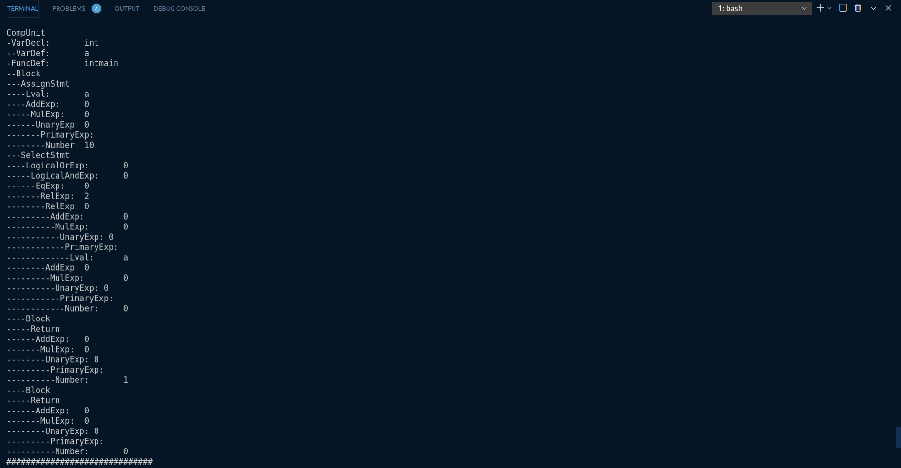

# 第五次进度报告

## 一.总体进度报告

总体完成的中间代码生成，为了方便后端代码编写，我结合使用LLVM的API去生成中间代码，将LLVM的API接在自己的语法树上，最终生成LLVM格式的中间代码。目前正在准备进行最终代码汇编代码的生成。

## 二.LLVM编译器中间代码生成

1. LLVM IR中的数据表示

   我们在程序中可以用来表示的数据，一共分为三类：

   * 寄存器中的数据
   * 栈上的数据
   * 数据区里的数据

   LLVM IR中，我们需要表示的数据也是以上三种。那么，这三种数据各有什么特点，又需要根据LLVM的特性做出什么样的调整呢？

   #### 数据区里的数据

   我们知道，数据区里的数据，其最大的特点就是，能够给整个程序的任何一个地方使用。同时，数据区里的数据也是占静态的二进制可执行程序的体积的。所以，我们应该只将需要全程序使用的变量放在数据区中。而现代编程语言的经验告诉我们，这类全局静态变量应该越少越好。

   同时，由于LLVM是面向多平台的，所以我们还需要考虑的是该怎么处理这些数据。一般来说，大多数平台的可执行程序格式中都会包含`.DATA`分区，用来存储这类的数据。但除此之外，每个平台还有专门的更加细致的分区，比如说，Linux的ELF格式中就有`.rodata`来存储只读的数据。因此，LLVM的策略是，让我们尽可能细致地定义一个全局变量，比如说注明其是否只读等，然后依据各个平台，如果平台的可执行程序格式支持相应的特性，就可以进行优化。

   一般来说，在LLVM IR中定义一个存储在数据区中的全局变量，其格式为：

   ```llvm
   @global_variable = global i32 0
   ```

   这个语句定义了一个`i32`类型的全局变量`@global_variable`，并且将其初始化为`0`。

   如果是只读的全局变量，也就是常量，我们可以用`constant`来代替`global`：

   ```llvm
   @global_constant = constant i32 0
   ```

   这个语句定义了一个`i32`类型的全局常量`@global_constant`，并将其初始化为`0`。

   #### 寄存器内的数据和栈上的数据

   这两种数据我选择放在一起讲。我们知道，除了DMA等奇技淫巧之外，大多数对数据的操作，如加减乘除、比大小等，都需要操作的是寄存器内的数据。那么，我们为什么需要把数据放在栈上呢？主要有两个原因：

   * 寄存器数量不够
   * 需要操作内存地址

   如果我们一个函数内有三四十个局部变量，但是家用型CPU最多也就十几个通用寄存器，所以我们不可能把所有变量都放在寄存器中，因此我们需要把一部分数据放在内存中，栈就是一个很好的存储数据的地方；此外，有时候我们需要直接操作内存地址，但是寄存器并没有通用的地址表示，所以只能把数据放在栈上来完成对地址的操作。

   因此，在不操作内存地址的前提下，栈只是寄存器的一个替代品。

   #### 寄存器

   正因为如此，LLVM IR引入了虚拟寄存器的概念。在LLVM IR中，一个函数的局部变量可以是寄存器或者栈上的变量。对于寄存器而言，我们只需要像普通的赋值语句一样操作，但需要注意名字必须以`%`开头：

   ```llvm
   %local_variable = add i32 1, 2
   ```

   此时，`%local_variable`这个变量就代表一个寄存器，它此时的值就是`1`和`2`相加的结果。我们可以写一个简单的程序验证这一点：

   ```llvm
   ; register_test.ll
   target datalayout = "e-m:o-i64:64-f80:128-n8:16:32:64-S128"
   target triple = "x86_64-apple-macosx10.15.0"
   
   define i32 @main() {
   	%local_variable = add i32 1, 2
   	ret i32 %local_variable
   }
   ```

   我们在x86_64的macOS系统上查看其编译出的汇编代码，其主函数为：

   ```assembly
   _main:
   	movl	$2, %eax
   	addl	$1, %eax
   	retq
   ```

   确实这个局部变量`%local_variable`变成了寄存器`eax`。

   关于寄存器，我们还需了解一点。在不同的ABI下，会有一些called-saved register和calling-saved register。简单来说，就是在函数内部，某些寄存器的值不能改变。或者说，在函数返回时，某些寄存器的值要和进入函数前相同。比如，在System V的ABI下，`rbp`, `rbx`, `r12`, `r13`, `r14`, `r15`都需要满足这一条件。由于LLVM IR是面向多平台的，所以我们需要一份代码适用于多种ABI。因此，LLVM IR内部自动帮我们做了这些事。如果我们把所有没有被保留的寄存器都用光了，那么LLVM IR会帮我们把这些被保留的寄存器放在栈上，然后继续使用这些被保留寄存器。当函数退出时，会帮我们自动从栈上获取到相应的值放回寄存器内。

   那么，如果所有通用寄存器都用光了，该怎么办？LLVM IR会帮我们把剩余的值放在栈上，但是对我们用户而言，实际上都是虚拟寄存器，用户是感觉不到差别的。

   因此，我们可以粗略地理解LLVM IR对寄存器的使用：

   * 当所需寄存器数量较少时，直接使用called-saved register，即不需要保留的寄存器
   * 当called-saved register不够时，将calling-saved register原本的值压栈，然后使用calling-saved register
   * 当寄存器用光以后，就把多的虚拟寄存器的值压栈

   我们可以写一个简单的程序验证。对于x86_64架构下，我们只需要使用15个虚拟寄存器就可以验证这件事。我们将其编译成汇编语言之后，可以看到在函数开头就有

   ```assembly
   pushq	%r15
   pushq	%r14
   pushq	%r13
   pushq	%r12
   pushq	%rbx
   ```

   也就是把那些需要保留的寄存器压栈。然后随着寄存器用光，第15个虚拟寄存器就会使用栈：

   ```assembly
   movl	%ecx, -4(%rsp)
   addl	$1, %ecx
   ```

   ### 栈

   我们之前说过，当不需要操作地址并且寄存器数量足够时，我们可以直接使用寄存器。而LLVM IR的策略保证了我们可以使用无数的虚拟寄存器。那么，在需要操作地址以及需要可变变量（之后会提到为什么）时，我们就需要使用栈。

   LLVM IR对栈的使用十分简单，直接使用`alloca`指令即可。如：

   ```llvm
   %local_variable = alloca i32
   ```

   就可以声明一个在栈上的变量了。

2. LLVM IR的数据类型表示

   #### 基本的数据类型

   LLVM IR中比较基本的数据类型包括：

   * 空类型（`void`）
   * 整型（`iN`）
   * 浮点型（`float`、`double`等）

   空类型一般是作为不返回值的函数的返回类型，没有特别的含义，就代表「什么都没有」。

   整型是指`i1`, `i8`, `i16`, `i32`, `i64`这类的数据类型。这里`iN`的`N`可以是任意正整数，可以是`i3`，`i1942652`。但最常用，最符合常理的就是`i1`以及8的整数倍。`i1`有两个值：`true`和`false`。也就是说，下面的代码可以正确编译：

   ```llvm
   %boolean_variable = alloca i1
   store i1 true, i1* %boolean_variable
   ```

   对于大于1位的整型，也就是如`i8`, `i16`等类型，我们可以直接用数字字面量赋值：

   ```llvm
   %integer_variable = alloca i32
   store i32 128, i32* %integer_variable
   store i32 -128, i32* %integer_variable
   ```

   #### 符号

   有一点需要注意的是，在LLVM IR中，整型默认是有符号整型，也就是说我们可以直接将`-128`以补码形式赋值给`i32`类型的变量。在LLVM IR中，整型的有无符号是体现在操作指令而非类型上的，比方说，对于两个整型变量的除法，LLVM IR分别提供了`udiv`和`sdiv`指令分别适用于无符号整型除法和有符号整型除法：

   ```llvm
   %1 = udiv i8 -6, 2	; get (256 - 6) / 2 = 125
   %2 = sdiv i8 -6, 2	; get (-6) / 2 = -3
   ```

   我们可以用这样一个简单的程序验证：

   ```llvm
   ; div_test.ll
   target datalayout = "e-m:o-i64:64-f80:128-n8:16:32:64-S128"
   target triple = "x86_64-apple-macosx10.15.0"
   
   define i8 @main() {
   	%1 = udiv i8 -6, 2
   	%2 = sdiv i8 -6, 2
   	
   	ret i8 %1
   }
   ```

   分别将`ret`语句的参数换成`%1`和`%2`以后，将代码编译成可执行文件，在终端下运行并查看返回值即可。

   总结一下就是，LLVM IR中的整型默认按有符号补码存储，但一个变量究竟是否要被看作有无符号数需要看其参与的指令。

3. LLVM IR的控制语句

   #### LLVM IR层面的控制语句

   下面就以我们上面的`for`循环的C语言版本为例，解释如何写其对应的LLVM IR语句。

   首先，我们对应的LLVM IR的基本框架为

   ```llvm
   %i = alloca i32 ; int i = ...
   store i32 0, i32* %i ; ... = 0
   %i_value = load i32, i32* %i
   ; do something A
   %1 = add i32 %i_value, 1 ; ... = i + 1
   store i32 %1, i32* %i ; i = ...
   ; do something B
   ```

   这个程序缺少了一些必要的步骤，而我们之后会将其慢慢补上。

   #### 标签

   在LLVM IR中，标签与汇编语言的标签一致，也是以`:`结尾作标记。我们依照之前写的汇编语言的伪代码，给这个程序加上标签：

   ```llvm
   	%i = alloca i32 ; int i = ...
   	store i32 0, i32* %i ; ... = 0
   start:
   	%i_value = load i32, i32* %i
   A:
   	; do something A
   	%1 = add i32 %i_value, 1 ; ... = i + 1
   	store i32 %1, i32* %i ; i = ...
   B:
   	; do something B
   ```

   #### 比较指令

   LLVM IR提供的比较指令为`icmp`。其接受三个参数：比较方案以及两个比较参数。这样讲比较抽象，我们就来看一下一个最简单的比较指令的例子：

   ```llvm
   %comparison_result = icmp uge i32 %a, %b
   ```

   这个例子转化为C++语言就是

   ```c++
   bool comparison_result = ((unsigned int)a >= (unsigned int)b);
   ```

   这里，`uge`是比较方案，`%a`和`%b`就是用来比较的两个数，而`icmp`则返回一个`i1`类型的值，也就是C++中的`bool`值，用来表示结果是否为真。

   `icmp`支持的比较方案很广泛：

   * 首先，最简单的是`eq`与`ne`，分别代表相等或不相等。
   * 然后，是无符号的比较`ugt`, `uge`, `ult`, `ule`，分别代表大于、大于等于、小于、小于等于。我们之前在数的表示中提到，LLVM IR中一个整型变量本身的符号是没有意义的，而是需要看在其参与的指令中被看作是什么符号。这里每个方案的`u`就代表以无符号的形式进行比较。
   * 最后，是有符号的比较`sgt`, `sge`, `slt`, `sle`，分别是其无符号版本的有符号对应。

   我们来看加上比较指令之后，我们的例子就变成了：

   ```llvm
   	%i = alloca i32 ; int i = ...
   	store i32 0, i32* %i ; ... = 0
   start:
   	%i_value = load i32, i32* %i
   	%comparison_result = icmp slt i32 %i_value, 4 ; test if i < 4
   A:
   	; do something A
   	%1 = add i32 %i_value, 1 ; ... = i + 1
   	store i32 %1, i32* %i ; i = ...
   B:
   	; do something B
   ```

   #### 条件跳转

   在比较完之后，我们需要条件跳转。我们来看一下我们此刻的目的：若`%comparison_result`是`true`，那么跳转到`A`，否则跳转到`B`。

   LLVM IR为我们提供的条件跳转指令是`br`，其接受三个参数，第一个参数是`i1`类型的值，用于作判断；第二和第三个参数分别是值为`true`和`false`时需要跳转到的标签。比方说，在我们的例子中，就应该是

   ```llvm
   br i1 %comparison_result, label %A, label %B
   ```

   我们把它加入我们的例子：

   ```llvm
   	%i = alloca i32 ; int i = ...
   	store i32 0, i32* %i ; ... = 0
   start:
   	%i_value = load i32, i32* %i
   	%comparison_result = icmp slt i32 %i_value, 4 ; test if i < 4
   	br i1 %comparison_result, label %A, label %B
   A:
   	; do something A
   	%1 = add i32 %i_value, 1 ; ... = i + 1
   	store i32 %1, i32* %i ; i = ...
   B:
   	; do something B
   ```

   #### 无条件跳转

   无条件跳转更好理解，直接跳转到某一标签处。在LLVM IR中，我们同样可以使用`br`进行条件跳转。如，如果要直接跳转到`start`标签处，则可以

   ```llvm
   br label %start
   ```

   我们也把这加入我们的例子：

   ```llvm
   	%i = alloca i32 ; int i = ...
   	store i32 0, i32* %i ; ... = 0
   start:
   	%i_value = load i32, i32* %i
   	%comparison_result = icmp slt i32 %i_value, 4 ; test if i < 4
   	br i1 %comparison_result, label %A, label %B
   A:
   	; do something A
   	%1 = add i32 %i_value, 1 ; ... = i + 1
   	store i32 %1, i32* %i ; i = ...
   	br label %start
   B:
   	; do something B
   ```

   

4. LLVM IR中的函数

   #### 函数定义

   在LLVM中，一个最基本的函数定义的样子我们之前已经遇到过多次，就是`@main`函数的样子：

   ```llvm
   define i32 @main() {
   	ret i32 0
   }
   ```

   在函数名之后可以加上参数列表，如：

   ```llvm
   define i32 @foo(i32 %a, i64 %b) {
   	ret i32 0
   }
   ```

   一个函数定义最基本的框架，就是返回值（`i32`）+函数名（`@foo`）+参数列表（`(i32 %a, i64 %b）`）+函数体（`{ ret i32 0 }`）。

   我们可以看到，函数的名称和全局变量一样，都是以`@`开头的。并且，如果我们查看符号表的话，也会发现其和全局变量一样进入了符号表。因此，函数也有和全局变量完全一致的Linkage Types和Visibility Style，来控制函数名在符号表中的出现情况，因此，可以出现如

   ```llvm
   define private i32 @foo() {
   	; ...
   }
   ```

   这样的修饰符。

   此外，我们还可以在参数列表之后加上之前说的属性，也就是控制优化器和代码生成器的指令。

   #### 函数声明

   除了函数定义之外，还有一种情况十分常见，那就是函数声明。我们在一个编译单元（模块）下，可以使用别的模块的函数，这时候就需要在本模块先声明这个函数，才能保证编译时不出错，从而在链接时正确将声明的函数与别的模块下其定义进行链接。

   函数声明也相对比较简单，就是使用`declare`关键词替换`define`：

   ```llvm
   declare i32 @printf(i8*, ...) #1
   ```

   这个就是在C代码中调用`stdio.h`库的`printf`函数时，在LLVM IR代码中可以看到的函数声明，其中`#1`就是又一大串属性组成的属性组。

   # 函数的调用

   在LLVM IR中，函数的调用与高级语言几乎没有什么区别：

   ```llvm
   define i32 @foo(i32 %a) {
   	; ...
   }
   
   define void @bar() {
   	%1 = call i32 @foo(i32 1)
   }
   ```

   使用`call`指令可以像高级语言那样直接调用函数。我们来仔细分析一下这里做了哪几件事：

   * 传递参数
   * 执行函数
   * 获得返回值

   居然能干这么多事，这是汇编语言所羡慕不已的。

## 三.自己编译器的效果展示

1. 测试样例1

   ```c++
   int main(){
       int a[4][2]={1,2,3,4,5,6,7,8};
       int b[4][2]={{a[0][0],a[0][1]},{3,4},{5,6},{7,8}};
       return 0;
   }
   ```

   生成的IR

   ```c++
   ; ModuleID = 'sysyc'
   source_filename = "/home/linux/Desktop/sysyruntimelibrary-master/section1/functional_test/02_arr_defn4.sy"
   target datalayout = "e-m:e-i64:64-f80:128-n8:16:32:64-S128"
   
   declare i32 @getint()
   
   declare i32 @getch()
   
   declare void @putint(i32)
   
   declare void @putch(i32)
   
   declare i32 @getarray(i32*)
   
   declare i32 @putarray(i32, i32*)
   
   define i32 @main() {
   entry:
     %0 = alloca [4 x [2 x i32]]
     %1 = getelementptr [4 x [2 x i32]], [4 x [2 x i32]]* %0, i32 0, i32 0
     %2 = getelementptr [2 x i32], [2 x i32]* %1, i32 0, i32 0
     store i32 1, i32* %2
     %3 = getelementptr i32, i32* %2, i32 1
     store i32 2, i32* %3
     %4 = getelementptr i32, i32* %3, i32 1
     store i32 3, i32* %4
     %5 = getelementptr i32, i32* %4, i32 1
     store i32 4, i32* %5
     %6 = getelementptr i32, i32* %5, i32 1
     store i32 5, i32* %6
     %7 = getelementptr i32, i32* %6, i32 1
     store i32 6, i32* %7
     %8 = getelementptr i32, i32* %7, i32 1
     store i32 7, i32* %8
     %9 = getelementptr i32, i32* %8, i32 1
     store i32 8, i32* %9
     %10 = getelementptr i32, i32* %9, i32 1
     %11 = alloca [4 x [2 x i32]]
     %12 = getelementptr [4 x [2 x i32]], [4 x [2 x i32]]* %0, i32 0, i32 0
     %13 = getelementptr [2 x i32], [2 x i32]* %12, i32 0, i32 0
     %14 = load i32, i32* %13
     %15 = getelementptr [4 x [2 x i32]], [4 x [2 x i32]]* %0, i32 0, i32 0
     %16 = getelementptr [2 x i32], [2 x i32]* %15, i32 0, i32 1
     %17 = load i32, i32* %16
     %18 = getelementptr [4 x [2 x i32]], [4 x [2 x i32]]* %11, i32 0, i32 0
     %19 = getelementptr [2 x i32], [2 x i32]* %18, i32 0, i32 0
     store i32 %14, i32* %19
     %20 = getelementptr i32, i32* %19, i32 1
     store i32 %17, i32* %20
     %21 = getelementptr i32, i32* %20, i32 1
     store i32 3, i32* %21
     %22 = getelementptr i32, i32* %21, i32 1
     store i32 4, i32* %22
     %23 = getelementptr i32, i32* %22, i32 1
     store i32 5, i32* %23
     %24 = getelementptr i32, i32* %23, i32 1
     store i32 6, i32* %24
     %25 = getelementptr i32, i32* %24, i32 1
     store i32 7, i32* %25
     %26 = getelementptr i32, i32* %25, i32 1
     store i32 8, i32* %26
     %27 = getelementptr i32, i32* %26, i32 1
     ret i32 0
   }
   ```

2. 测试样例2

   ```c++
   int a;
   int main(){
   	a = 10;
   	if( a>0 ){
   		return 1;
   	}
   	else{
   		return 0;
   	}
   }
   ```

   这是一个带有控制结构if-else的样例，输出结果如下

   ```c++
   ; ModuleID = 'sysyc'
   source_filename = "../test.sy"
   target datalayout = "e-m:e-i64:64-f80:128-n8:16:32:64-S128"
   
   @0 = global i32 zeroinitializer
   
   declare i32 @getint()
   
   declare i32 @getch()
   
   declare void @putint(i32)
   
   declare void @putch(i32)
   
   declare i32 @getarray(i32*)
   
   declare i32 @putarray(i32, i32*)
   
   define i32 @main() {
   entry:
     store i32 10, i32* @0
     %0 = load i32, i32* @0
     %1 = icmp sgt i32 %0, 0
     %2 = zext i1 %1 to i32
     %3 = icmp ne i32 %2, 0
     br i1 %3, label %4, label %5
   
   ; <label>:4:                                      ; preds = %entry
     ret i32 1
   
   ; <label>:5:                                      ; preds = %entry
     ret i32 0
   }
   
   ```

   树形结构如下：

   

3. 测试样例3

   ```c++
   int n;
   int fib(int p){
   	int a;
   	int b;
   	int c;
   	a = 0;
   	b = 1;
   	if ( p == 0 ){
   		return 0;
   	}
   	if ( p == 1 ){
   		return 1;
   	}
   	while ( p > 1 ){
   		c = a + b;
   		a = b;
   		b = c;
   		p = p - 1;
   	}
   	return c;
   }
   int main(){
   	n = getint();
   	int res;
   	res = fib( n );
   	return res;
   }
   ```

   这是一个带有带有io（使用组委会提供的链接库）的样例。

   中间代码：

   ```c++
   ; ModuleID = 'sysyc'
   source_filename = "../test.sy"
   target datalayout = "e-m:e-i64:64-f80:128-n8:16:32:64-S128"
   
   @0 = global i32 zeroinitializer
   
   declare i32 @getint()
   
   declare i32 @getch()
   
   declare void @putint(i32)
   
   declare void @putch(i32)
   
   declare i32 @getarray(i32*)
   
   declare i32 @putarray(i32, i32*)
   
   define i32 @fib(i32) {
   entry:
     %1 = alloca i32
     store i32 %0, i32* %1
     %2 = alloca i32
     %3 = alloca i32
     %4 = alloca i32
     store i32 0, i32* %2
     store i32 1, i32* %3
     %5 = load i32, i32* %1
     %6 = icmp eq i32 %5, 0
     %7 = zext i1 %6 to i32
     %8 = icmp ne i32 %7, 0
     br i1 %8, label %9, label %10
   
   ; <label>:9:                                      ; preds = %entry
     ret i32 0
   
   ; <label>:10:                                     ; preds = %entry
     %11 = load i32, i32* %1
     %12 = icmp eq i32 %11, 1
     %13 = zext i1 %12 to i32
     %14 = icmp ne i32 %13, 0
     br i1 %14, label %15, label %16
   
   ; <label>:15:                                     ; preds = %10
     ret i32 1
   
   ; <label>:16:                                     ; preds = %10
     br label %17
   
   ; <label>:17:                                     ; preds = %22, %16
     %18 = load i32, i32* %1
     %19 = icmp sgt i32 %18, 1
     %20 = zext i1 %19 to i32
     %21 = icmp ne i32 %20, 0
     br i1 %21, label %22, label %30
   
   ; <label>:22:                                     ; preds = %17
     %23 = load i32, i32* %2
     %24 = load i32, i32* %3
     %25 = add i32 %23, %24
     store i32 %25, i32* %4
     %26 = load i32, i32* %3
     store i32 %26, i32* %2
     %27 = load i32, i32* %4
     store i32 %27, i32* %3
     %28 = load i32, i32* %1
     %29 = sub i32 %28, 1
     store i32 %29, i32* %1
     br label %17
   
   ; <label>:30:                                     ; preds = %17
     %31 = load i32, i32* %4
     ret i32 %31
   }
   
   define i32 @main() {
   entry:
     %0 = call i32 @getint()
     store i32 %0, i32* @0
     %1 = alloca i32
     %2 = load i32, i32* @0
     %3 = call i32 @fib(i32 %2)
     store i32 %3, i32* %1
     %4 = load i32, i32* %1
     ret i32 %4
   }
   
   ```


## 四.后续计划

1. 完成最后的代码生成
2. 进行测试样例的测试，并对BUG进行修改