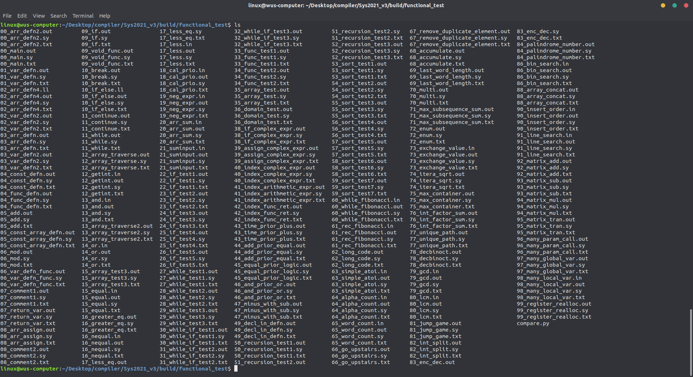
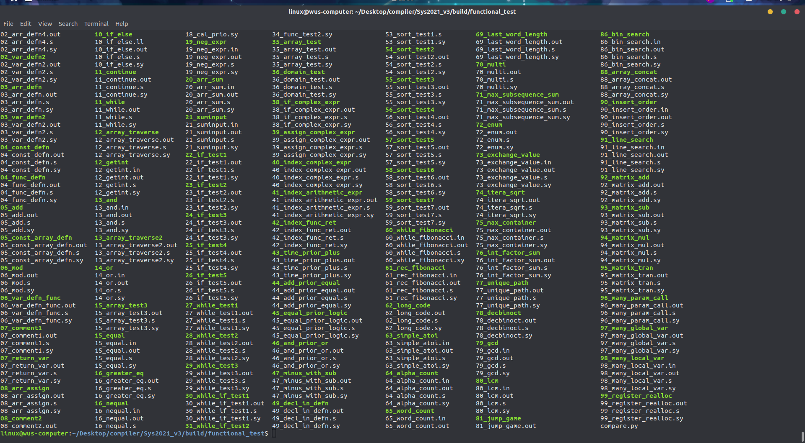
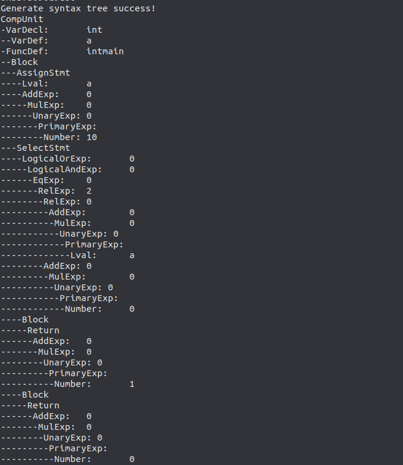
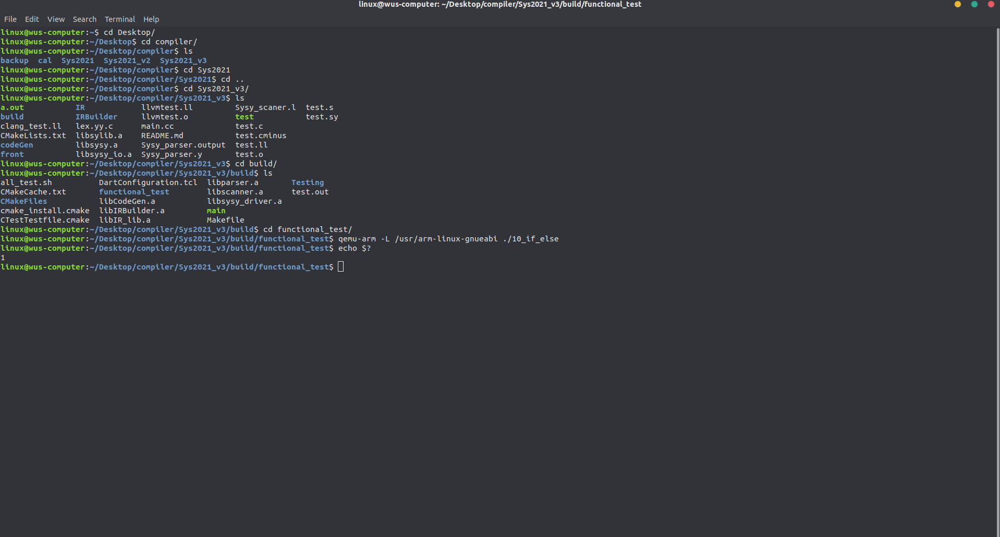
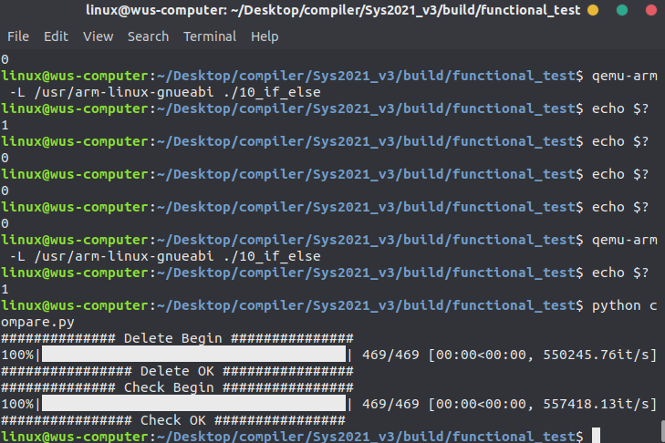
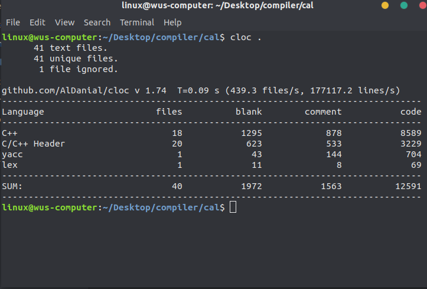
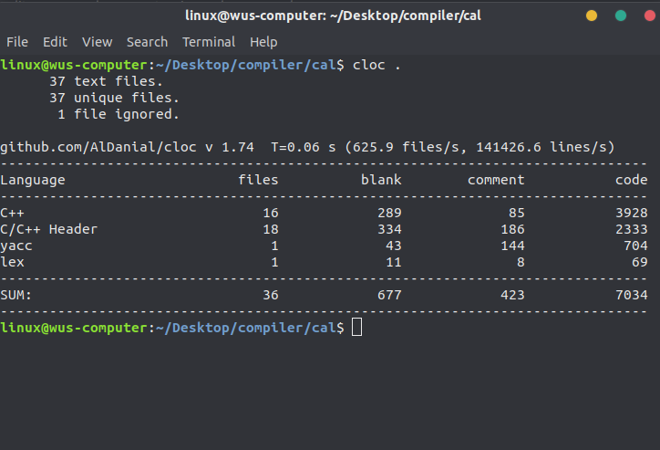

# 第六次进度报告

## 1.总体进度情况

完成了使用LLVM做后端的第一个版本,编译器已经在本机可以正常运行, 用比赛的功能样例测试,全部通过.同时,为了增强自己对编译器的理解,完成了第二个版本的编译器的中间代码生成,这个编译器是自己参考中科大实验课教程以及北航实验课教程自己实现了IR的每一个块,已经可以生成LLVM的中间代码,后端代码已经完成了编写,同样也通过了所有的测试样例

## 2. 效果展示

首先我们可以先测试一下编译器能否正常编译所有文件

编译前文件夹如下所示:



编译后文件夹:



可以看到,每一个代码都对应了一个.s文件(汇编代码)和可执行文件(可以使用qemu-arm进行测试)

我们用一个简单的代码来展示一下编译器的效果

```c++
int a;
int main(){
	a = 10;
	if( a>0 ){
		return 1;
	}
	else{
		return 0;
	}
}
```

输出我们的语法树结构如下所示:



中间代码为LLVM格式的中间代码

```llvm
; ModuleID = 'SysY code'
source_filename = ""
@a = global i32 0
declare i32 @getint()

declare i32 @getch()

declare void @putint(i32)

declare void @putch(i32)

declare i32 @getarray(i32*)

declare i32 @putarray(i32, i32*)

declare void @_sysy_starttime(i32)

declare void @_sysy_stoptime(i32)

define i32 @main() {
entry:
  store i32 10, i32* @a
  %op0 = load i32, i32* @a
  %op1 = icmp sgt i32 %op0, 0
  %op2 = zext i1 %op1 to i32
  %op3 = icmp ne i32 %op2, 0
  br i1 %op3, label %label4, label %label5
label4:                                                ; preds = %entry
  ret i32 1
label5:                                                ; preds = %entry
  ret i32 0
}
```

生成的arm7-a汇编

```arm
    .arch armv7-a
    .file ""
    .text
    .global main
    .syntax unified
    .arm
    .global a
.global_vars:
    .long a
main:
.main_pre:
    push {lr}
    mov r12, #16
    sub sp, sp, r12
.main_entry:
    ldr lr, =#10
    adrl r11, .global_vars+0
    ldr r12, [r11, #0]
    str lr, [r12, #0]
    adrl r11, .global_vars+0
    ldr lr, [r11, #0]
    ldr r12, [lr, #0]
    str r12, [sp, #0]
    ldr r12, [sp, #0]
    ldr lr, =#0
    cmp r12, lr
    mov r12, #0
    movgt r12, #1
    str r12, [sp, #4]
    ldr r12, [sp, #4]
    str r12, [sp, #8]
    ldr r12, [sp, #8]
    ldr lr, =#0
    cmp r12, lr
    mov r12, #0
    movne r12, #1
    str r12, [sp, #12]
    ldr r12, [sp, #12]
    cmp r12, #0
    bne .main_label4+0
    b .main_label5+0
.main_label4:
    ldr r0, =#1
    mov r12, #16
    add sp, sp, r12
    pop {pc}
.main_label5:
    ldr r0, =#0
    mov r12, #16
    add sp, sp, r12
    pop {pc}
.main_post:
    .data
a:
    .long 0
```

最后生成的可执行文件的运行结果



我们可以看到,程序正常的运行,与我们预期相符合

我们在所有写了一个脚本,用我们的编译器编译所有的测试样例生成am汇编,并在qemu-arm中进行执行,把输出重定向到与可执行文件同名字的txt中,脚本如下:

```bash
#!/bin/bash
cd ./functional_test/
filenames=$(ls *.sy)
for file in ${filenames};do
    /home/linux/Desktop/compiler/Sys2021_v3/build/main ${file}
done
filenames=$(ls *.s)
for file in ${filenames};do
    echo ${file%.*}
    arm-linux-gnueabi-gcc -o ${file%.*} -g ${file} ../../libsylib.a
    if [ -e ${file%.*}.in ] ;then
	    echo ${file%.*}.in
	    qemu-arm -L /usr/arm-linux-gnueabi ${file%.*} <  ${file%.*}.in > ${file%.*}.txt
    else
	    qemu-arm -L /usr/arm-linux-gnueabi ${file%.*} > ${file%.*}.txt
    fi
    result=$(echo $?)
    echo -e >> ${file%.*}.txt
    echo ${result} >> ${file%.*}.txt
done
```

并用Python代码比对官方提供的out文件与我们执行的txt文件

```python
import os
import sys
from tqdm import tqdm


def deleteSpaceLines(dirname):

    for maindir, subdir, file_name_list in os.walk(dirname):
        for filename in tqdm(file_name_list):
            path = os.path.join(maindir, filename)
            if(os.path.splitext(path)[1]!='.txt'):
                continue
            txt = []
            f1 = open(path,'r',encoding='ascii')
            cnt=0
            for line in f1.readlines():
                if cnt==0 and line == '\n':
                    continue
                txt.append(line)
            f1.close()
            os.remove(path)
            f2 = open(path,'w',encoding='ascii')
            f2.write(''.join(txt))
            f2.close()
def Comparetxt(dirname):
    for maindir, subdir, file_name_list in os.walk(dirname):
        for filename in tqdm(file_name_list):
            path = os.path.join(maindir, filename)
            if(os.path.splitext(path)[1]!='.txt'):
                continue
            file=os.path.splitext(path)[0]+'.out'
            txt = []
            txt2 = []
            f1 = open(path,'r',encoding='ascii')
            for line in f1.readlines():
                txt.append(line.strip('\n'))
            f1.close()
            f2 = open(file,'r',encoding='ascii')
            for line in f2.readlines():
                txt2.append(line.strip('\n'))
            f2.close()
            # print(file)
            # print(txt)
            # print(txt2)
            for i in range(len(txt)):
                if txt[i]!=txt2[i]:
                    print("Error")
                    print(txt)
                    print(txt2)
                    print(os.path.splitext(path)[0])
                    break

if __name__ == '__main__':
    path="./"
    print("############## Delete Begin ###############")
    deleteSpaceLines(path)
    print("################ Delete OK ################")
    print("############## Check Begin ################")
    Comparetxt(path)
    print("################ Check OK ################")
```

批量测试的时候首先去除一些输出文件的第一行的空格(是由于有的程序输出运行时间)

当有错误的时候,输出答案与我们的测试结果,以及出错的样例的名字



可于看到我们所有的样例都可以正常的通过.

## 3.提交文件说明

提交的为编译器的完整代码

## 4.代码行数统计

加工具生成的代码总数



不加工具生成的代码的代码统计

