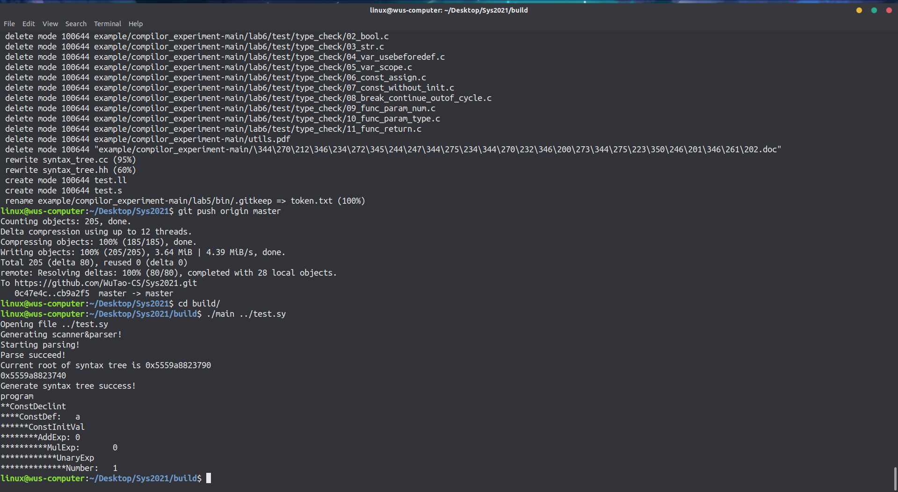
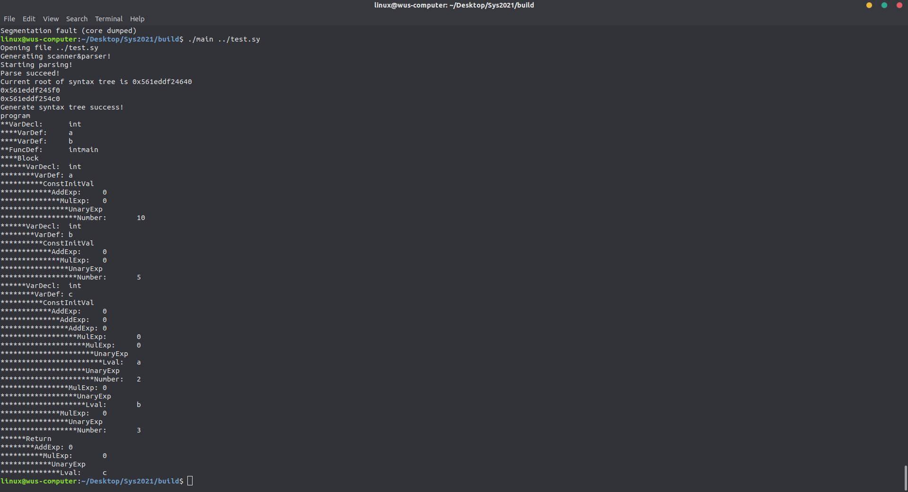
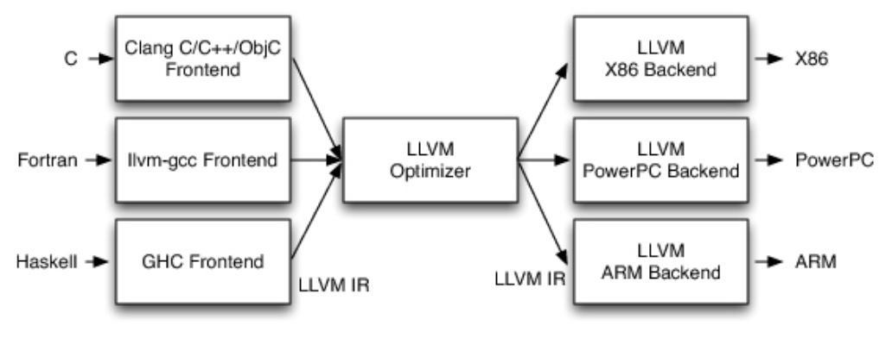
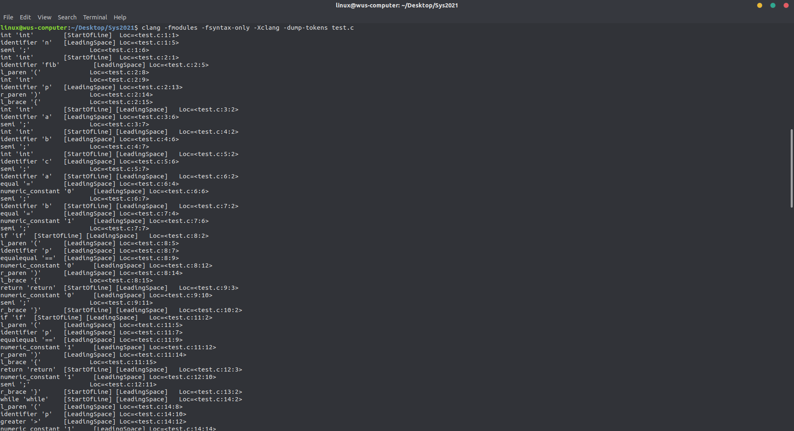
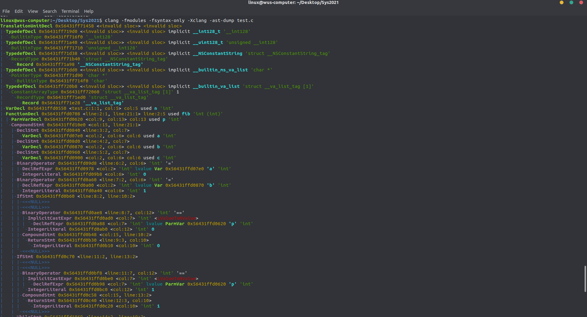
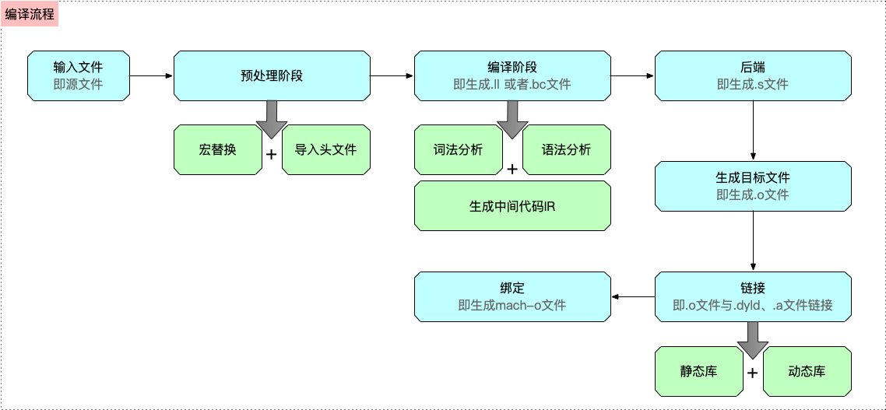

# 第三次进度报告

## 1.总体进度说明

本周由于参与老师的实验室考核，占用了大量的时间去准备，因此没有什么太大的进展，重新修改了语法树，并将建立的语法树输出出来（可视化一下，方便debug和判断语法分析模块是否正常工作），未来两周时间会空余出来，预计在未来两周全身心的重新投入到编译器的后端，尽快完成。

## 2.语法树测试截图

1. 先用一个简单的测试样例

   ```c++
   const int a=1;
   ```

   我们看一下程序的运行输出的结果：

   

   可以看到，我们的语法树的结构成功的进行了输出

   

2. 用一个稍微难一点的

   ```
   int a,b;
   
   int main(){
       int a=10;
       int b=5;
       int c=a*2+b+3;
       return c;
   }
   ```

   结果如下：

   

   可以看到也是可以正确进行分析的。

## 3.计划实现中间代码生成的方式

1. 直接与LLVM的IR相连

   

2. 自己实现一个IR

   感觉自己写工作量有点太大，或者是继续迁移中科大的代码完成IR的编写。

## 4.LLVM编译过程分析

我们以一个C语言为例，逐步分析LLVM的编译过程，代码如下：

```c
int n;
int fib(int p){
	int a;
	int b;
	int c;
	a = 0;
	b = 1;
	if ( p == 0 ){
		return 0;
	}
	if ( p == 1 ){
		return 1;
	}
	while ( p > 1 ){
		c = a + b;
		a = b;
		b = c;
		p = p - 1;
	}
	return c;
}
int main(){
	int res;
	res = fib( n );
	return res;
}
```


1. 输入文件并找到源文件

2. 预处理阶段，包括宏替换和头文件导入

   以上两步是很正常的步骤，因此不截图进行详细描述

3. 编译阶段，进行词法分析，语法分析，检测语法是否正确，并生成最终IR

   词法分析的结果如下：

   

   语法分析结果如下：

   

   

4. 生成IR中间代码：

   完成以上步骤后，就开始生成中间代码IR了，`代码生成器`（Code Generation）会将`语法树自顶向下遍历`逐步翻译成`LLVM IR`，

   ```
   ; ModuleID = 'test.c'
   source_filename = "test.c"
   target datalayout = "e-m:e-i64:64-f80:128-n8:16:32:64-S128"
   target triple = "x86_64-pc-linux-gnu"
   
   @n = common global i32 0, align 4
   
   ; Function Attrs: noinline nounwind optnone uwtable
   define i32 @fib(i32) #0 {
     %2 = alloca i32, align 4
     %3 = alloca i32, align 4
     %4 = alloca i32, align 4
     %5 = alloca i32, align 4
     %6 = alloca i32, align 4
     store i32 %0, i32* %3, align 4
     store i32 0, i32* %4, align 4
     store i32 1, i32* %5, align 4
     %7 = load i32, i32* %3, align 4
     %8 = icmp eq i32 %7, 0
     br i1 %8, label %9, label %10
   
   ; <label>:9:                                      ; preds = %1
     store i32 0, i32* %2, align 4
     br label %28
   
   ; <label>:10:                                     ; preds = %1
     %11 = load i32, i32* %3, align 4
     %12 = icmp eq i32 %11, 1
     br i1 %12, label %13, label %14
   
   ; <label>:13:                                     ; preds = %10
     store i32 1, i32* %2, align 4
     br label %28
   
   ; <label>:14:                                     ; preds = %10
     br label %15
   
   ; <label>:15:                                     ; preds = %18, %14
     %16 = load i32, i32* %3, align 4
     %17 = icmp sgt i32 %16, 1
     br i1 %17, label %18, label %26
   
   ; <label>:18:                                     ; preds = %15
     %19 = load i32, i32* %4, align 4
     %20 = load i32, i32* %5, align 4
     %21 = add nsw i32 %19, %20
     store i32 %21, i32* %6, align 4
     %22 = load i32, i32* %5, align 4
     store i32 %22, i32* %4, align 4
     %23 = load i32, i32* %6, align 4
     store i32 %23, i32* %5, align 4
     %24 = load i32, i32* %3, align 4
     %25 = sub nsw i32 %24, 1
     store i32 %25, i32* %3, align 4
     br label %15
   
   ; <label>:26:                                     ; preds = %15
     %27 = load i32, i32* %6, align 4
     store i32 %27, i32* %2, align 4
     br label %28
   
   ; <label>:28:                                     ; preds = %26, %13, %9
     %29 = load i32, i32* %2, align 4
     ret i32 %29
   }
   
   ; Function Attrs: noinline nounwind optnone uwtable
   define i32 @main() #0 {
     %1 = alloca i32, align 4
     %2 = alloca i32, align 4
     store i32 0, i32* %1, align 4
     %3 = load i32, i32* @n, align 4
     %4 = call i32 @fib(i32 %3)
     store i32 %4, i32* %2, align 4
     %5 = load i32, i32* %2, align 4
     ret i32 %5
   }
   
   attributes #0 = { noinline nounwind optnone uwtable "correctly-rounded-divide-sqrt-fp-math"="false" "disable-tail-calls"="false" "less-precise-fpmad"="false" "no-frame-pointer-elim"="true" "no-frame-pointer-elim-non-leaf" "no-infs-fp-math"="false" "no-jump-tables"="false" "no-nans-fp-math"="false" "no-signed-zeros-fp-math"="false" "no-trapping-math"="false" "stack-protector-buffer-size"="8" "target-cpu"="x86-64" "target-features"="+fxsr,+mmx,+sse,+sse2,+x87" "unsafe-fp-math"="false" "use-soft-float"="false" }
   
   !llvm.module.flags = !{!0}
   !llvm.ident = !{!1}
   
   !0 = !{i32 1, !"wchar_size", i32 4}
   !1 = !{!"clang version 6.0.0-1ubuntu2 (tags/RELEASE_600/final)"}
   ```

   当然，也可以进行一定的优化。LLVM的优化级别分别是`-O0 -O1 -O2 -O3 -Os`(第一个是大写英文字母O)

5. 后端：LLVM进行逐个PASS的优化，每个PASS做一些事情，最终生成汇编代码

   ```shell
   clang -S -fobjc-arc test.ll -o test.s
   ```

   生成的汇编代码如下

   ```
   	.text
   	.file	"test.c"
   	.globl	fib                     # -- Begin function fib
   	.p2align	4, 0x90
   	.type	fib,@function
   fib:                                    # @fib
   	.cfi_startproc
   # %bb.0:
   	pushq	%rbp
   	.cfi_def_cfa_offset 16
   	.cfi_offset %rbp, -16
   	movq	%rsp, %rbp
   	.cfi_def_cfa_register %rbp
   	movl	%edi, -8(%rbp)
   	movl	$0, -12(%rbp)
   	movl	$1, -16(%rbp)
   	cmpl	$0, -8(%rbp)
   	jne	.LBB0_2
   # %bb.1:
   	movl	$0, -4(%rbp)
   	jmp	.LBB0_8
   .LBB0_2:
   	cmpl	$1, -8(%rbp)
   	jne	.LBB0_4
   # %bb.3:
   	movl	$1, -4(%rbp)
   	jmp	.LBB0_8
   .LBB0_4:
   	jmp	.LBB0_5
   .LBB0_5:                                # =>This Inner Loop Header: Depth=1
   	cmpl	$1, -8(%rbp)
   	jle	.LBB0_7
   # %bb.6:                                #   in Loop: Header=BB0_5 Depth=1
   	movl	-12(%rbp), %eax
   	addl	-16(%rbp), %eax
   	movl	%eax, -20(%rbp)
   	movl	-16(%rbp), %eax
   	movl	%eax, -12(%rbp)
   	movl	-20(%rbp), %eax
   	movl	%eax, -16(%rbp)
   	movl	-8(%rbp), %eax
   	subl	$1, %eax
   	movl	%eax, -8(%rbp)
   	jmp	.LBB0_5
   .LBB0_7:
   	movl	-20(%rbp), %eax
   	movl	%eax, -4(%rbp)
   .LBB0_8:
   	movl	-4(%rbp), %eax
   	popq	%rbp
   	retq
   .Lfunc_end0:
   	.size	fib, .Lfunc_end0-fib
   	.cfi_endproc
                                           # -- End function
   	.globl	main                    # -- Begin function main
   	.p2align	4, 0x90
   	.type	main,@function
   main:                                   # @main
   	.cfi_startproc
   # %bb.0:
   	pushq	%rbp
   	.cfi_def_cfa_offset 16
   	.cfi_offset %rbp, -16
   	movq	%rsp, %rbp
   	.cfi_def_cfa_register %rbp
   	subq	$16, %rsp
   	movl	$0, -4(%rbp)
   	movl	n, %edi
   	callq	fib
   	movl	%eax, -8(%rbp)
   	movl	-8(%rbp), %eax
   	addq	$16, %rsp
   	popq	%rbp
   	retq
   .Lfunc_end1:
   	.size	main, .Lfunc_end1-main
   	.cfi_endproc
                                           # -- End function
   	.type	n,@object               # @n
   	.comm	n,4,4
   
   	.ident	"clang version 6.0.0-1ubuntu2 (tags/RELEASE_600/final)"
   	.section	".note.GNU-stack","",@progbits
   
   ```

6. 汇编代码生成目标文件

   目标文件的生成，是汇编器以`汇编代码作为插入`，将汇编代码`转换为机器代码`，最后输出目标文件

7. 链接需要的动态库和静态库，生成可执行文件

   链接主要是链接需要的动态库和静态库，生成可执行文件，其中

   - 静态库会和可执行文件合并
   - 动态库是独立的

8. 绑定，通过不同的架构，生成对应的可执行文件

   绑定主要是通过不同的架构，生成对应的mach-o格式可执行文件

综上，所述，LLVM的编译流程如下图所示

- 

